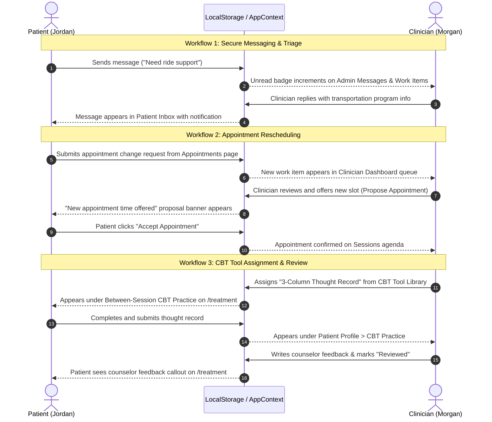

# BHG Connected Care Portal — Comprehensive Application Guide & Module Walkthrough

Welcome to the **BHG Connected Care Portal** architectural and functional guide. This document provides an exhaustive, end-to-end walkthrough of the proof-of-concept (PoC) platform built for **Behavioral Health Group (BHG)**, detailing its mission, architecture, data flow, dual-portal personas, and each individual functional module.

---

## Table of Contents
1. [Executive Summary & Clinical Mission](#1-executive-summary--clinical-mission)
2. [Technology Stack & Architecture](#2-technology-stack--architecture)
3. [Authentication & Multi-Role Access](#3-authentication--multi-role-access)
4. [Connected State Engine & Persistence](#4-connected-state-engine--persistence)
5. [Patient Portal Modules Walkthrough](#5-patient-portal-modules-walkthrough)
   - 5.1 [Patient Dashboard (Home)](#51-patient-dashboard-home)
   - 5.2 [My Treatment](#52-my-treatment)
   - 5.3 [Between-Session CBT Practice & Coping Exercises](#53-between-session-cbt-practice--coping-exercises)
   - 5.4 [Medication Schedule & Take-Home Protocol](#54-medication-schedule--take-home-protocol)
   - 5.5 [Visits & Clinical Appointments](#55-visits--clinical-appointments)
   - 5.6 [Lab & Toxicology (UDS)](#56-lab--toxicology-uds)
   - 5.7 [My Records & Clinical History](#57-my-records--clinical-history)
   - 5.8 [Treatment Center & Directions](#58-treatment-center--directions)
   - 5.9 [Secure Messaging](#59-secure-messaging)
   - 5.10 [Recovery Progress & Milestones](#510-recovery-progress--milestones)
   - 5.11 [Forms, Consents & Documents](#511-forms-consents--documents)
   - 5.12 [Coverage, Payments & Financial Assistance](#512-coverage-payments--financial-assistance)
   - 5.13 [Profile, Privacy & Notification Preferences](#513-profile-privacy--notification-preferences)
   - 5.14 [Support & FAQ](#514-support--faq)
   - 5.15 [AI Support Assistant (Chatbot Widget)](#515-ai-support-assistant-chatbot-widget)
   - 5.16 [Need Help Today? Triage Panel](#516-need-help-today-triage-panel)
6. [Clinician Portal Modules Walkthrough](#6-clinician-portal-modules-walkthrough)
   - 6.1 [Clinician Dashboard](#61-clinician-dashboard)
   - 6.2 [Sessions & Appointments Agenda](#62-sessions--appointments-agenda)
   - 6.3 [My Caseload](#63-my-caseload)
   - 6.4 [Patient Profile & Charting](#64-patient-profile--charting)
   - 6.5 [Secure Messages & Request Triage](#65-secure-messages--request-triage)
   - 6.6 [Group Sessions Management](#66-group-sessions-management)
   - 6.7 [CBT Tool Library & Active Assignment](#67-cbt-tool-library--active-assignment)
   - 6.8 [Care Coordination & Referrals](#68-care-coordination--referrals)
   - 6.9 [Medication Visit Status & Dispensing Queue](#69-medication-visit-status--dispensing-queue)
   - 6.10 [UDS & Lab Tracking](#610-uds--lab-tracking)
   - 6.11 [Clinical Documentation (Session Notes)](#611-clinical-documentation-session-notes)
7. [Cross-Portal Bi-Directional Workflows](#7-cross-portal-bi-directional-workflows)
8. [Data Models & Seed Architecture](#8-data-models--seed-architecture)
9. [Production Roadmap & Security Standards](#9-production-roadmap--security-standards)

---

## 1. Executive Summary & Clinical Mission

The **BHG Connected Care Portal** is an interactive, browser-persistent healthcare application tailored specifically to the outpatient addiction medicine domain, including:
- **Opioid Treatment Programs (OTP)**
- **Office-Based Opioid Treatment (OBOT)**
- **Intensive Outpatient Programs (IOP)**
- **Medication-Assisted Treatment (MAT)** with Methadone, Buprenorphine/Suboxone, and Naltrexone/Vivitrol.

### The Problem It Solves
Traditional electronic health records (EHRs) and patient portals often treat substance use disorder (SUD) patients like standard outpatient medical clinics. In reality, OTP/OBOT patients face distinct daily logistics:
- Strict daily medication dispensing windows.
- Regulated take-home bottle step-ups and compliance call-backs.
- Routine random urine drug screens (UDS).
- Mandatory counseling sessions and group therapy hours.
- Highly sensitive privacy requirements governed by **42 CFR Part 2**.

### The Connected Care Solution
The application bridges the communication gap between patients and clinic staff through a synchronized dual-portal interface:
1. **Patient Portal**: Empowers patients with clear visibility into their daily dosing windows, appointments, take-home tiers, lab results in supportive destigmatized language, CBT coping exercises, and care team messaging.
2. **Clinician Portal**: Equips counselors, case managers, and clinic administrators with a centralized workstation to monitor their caseload, review daily appointments, record visit outcomes, run group therapy sessions, assign evidence-based CBT exercises, and triage patient requests in real time.

---

## 2. Technology Stack & Architecture

```
┌─────────────────────────────────────────────────────────────┐
│                       React 18 SPA                          │
│        (Vite 5 Build Tooling + React Router DOM v6)         │
├──────────────────────────────┬──────────────────────────────┤
│      Patient Portal UI       │     Clinician Portal UI      │
│  - Responsive Navigation     │  - Caseload & Agenda Views   │
│  - Destigmatized Terminology │  - Multi-Center Selector     │
│  - Micro-Interactions        │  - Modal Clinical Workflows  │
├──────────────────────────────┴──────────────────────────────┤
│                     Central AppContext                      │
│        - Session & Role Routing (Patient vs Admin)          │
│        - Unified Event Dispatcher & Toast Notifications     │
│        - Bi-directional State Sync (localStorage v5)        │
├─────────────────────────────────────────────────────────────┤
│                     Mock Data & Domain                      │
│        - bhgPatientData.js (Rich Clinical Seed Data)        │
│        - bhgDemoState.js (Persistent Reactive State)        │
└─────────────────────────────────────────────────────────────┘
```

### Core Technologies
- **Framework**: [React 18](https://react.dev/) using modern Functional Components and custom Hooks.
- **Build & Development Server**: [Vite 5](https://vitejs.dev/) with hot module replacement (HMR).
- **Client Routing**: [React Router DOM v6](https://reactrouter.com/) configured with client-side SPA routing (`/dashboard`, `/treatment`, `/admin-dashboard`, etc.).
- **Styling Architecture**: Curated design system implemented via modern CSS:
  - `bhgPortal.css`: Design tokens, card styles, status badges, typography, grid layouts, and custom scrollbars.
  - `index.css`: Baseline reset, utility classes, animations, and modal overlays.
  - `theme.css`: Palette tokens featuring BHG navy (`#0B2545`), teal (`#137547`), slate, and neutral tones.
- **Iconography**: [Lucide React](https://lucide.dev/) for consistent, accessible medical iconography.

---

## 3. Authentication & Multi-Role Access

The portal includes an integrated authentication layer simulating realistic role-based access control (RBAC).

### Demo Credentials
| Persona | Email | Password | Assigned Role | Landing Route |
| :--- | :--- | :--- | :--- | :--- |
| **Patient** (*Jordan Williams*) | `patient@demo.com` | `Password123` | `patient` | `/dashboard` |
| **Clinician** (*Morgan Reed, LPC*) | `admin@demo.com` | `Password123` | `admin` | `/admin-dashboard` |

### Multi-Treatment Center Switcher
Clinicians can filter their views and patient queues across three realistic BHG treatment centers or select an aggregated overview:
1. **BHG Knoxville Bernard Treatment Center** (Knoxville, TN)
2. **BHG Knoxville Citico Treatment Center** (Knoxville, TN)
3. **BHG Jackson TN Treatment Center** (Jackson, TN)
4. **All Treatment Centers** (Aggregated Enterprise View)

---

## 4. Connected State Engine & Persistence

A hallmark of this application is its **bi-directional connected state engine**:
- **Browser-Persistent (`localStorage`)**: State is keyed under `bhg-connected-demo-state-v5`. Changes made in one portal persist across browser refreshes, tab switches, and session logouts.
- **Interconnected Data Flow**:
  - A message sent by the patient immediately surfaces in the Clinician's unread queue.
  - An appointment change request created by the patient appears in the Clinician's work items.
  - An appointment outcome recorded by the Clinician triggers a notification in the Patient Portal.
  - A CBT homework assigned by the counselor in the CBT Tool Library instantly populates the Patient's Treatment screen and the Patient Chart's CBT Practice tab.
  - Counselor feedback written on a patient's CBT submission reflects live in the patient's portal with visual callouts and badges.
- **Demo State Reset**: Clinicians can click the "Reset Demo Data" button on the Clinician Dashboard at any time to return the application to its clean initial demonstration baseline.

---

## 5. Patient Portal Modules Walkthrough

The Patient Portal is purposefully designed with empathy, clarity, and destigmatizing language to support patients along their recovery journey.

### 5.1 Patient Dashboard (Home)
- **Route**: `/dashboard`
- **Purpose**: Central command center greeting the patient upon login.
- **Key Features**:
  - **Dosing Window Status Banner**: Live countdown showing today's medication window hours (e.g., *5:30 AM – 11:30 AM*).
  - **Treatment Stage Badge**: Displays current phase (*Stabilization Phase 2*) and days in recovery (*184 Days*).
  - **Next Required Action Callout**: Highlights immediate clinical or paperwork obligations (e.g., annual consent review).
  - **Today's Schedule**: Quick access to upcoming counseling visits and dispensing hours.
  - **Quick Action Buttons**: Fast shortcuts to message care team, request appointment change, or access emergency contacts.
  - **Recent Activity Feed**: Chronological history of lab updates, payment verifications, and treatment plan milestones.

### 5.2 My Treatment
- **Route**: `/treatment`
- **Purpose**: Comprehensive view of the patient's active clinical regimen and multidisciplinary care team.
- **Key Features**:
  - **Medication Overview Card**: Details active medication (*Buprenorphine/Naloxone Film 16mg/4mg daily*), prescriber, and next renewal date.
  - **Care Team Cards**: Displays assigned primary counselor, medical provider, and financial counselor with their availability hours.
  - **Program Milestones**: Visual progress stepper demonstrating patient's progression through Induction, Stabilization, and Maintenance.

### 5.3 Between-Session CBT Practice & Coping Exercises
- **Integrated Within**: `/treatment`
- **Purpose**: Extends recovery care beyond the clinic walls by enabling patients to review evidence-based cognitive behavioral coping exercises assigned by their counselor.
- **Key Features**:
  - **Exercise Cards**: Shows exercise category (*Cognitive Restructuring*, *Craving Management*), status badges (*Reviewed*, *In Progress*), and submission dates.
  - **Counselor Feedback Callout**: Dedicated highlight card displaying written comments from their primary counselor (e.g., *"Great work recognizing these thinking traps, Jordan..."*).
  - **Review Detail Modal**: Clicking an exercise opens a full modal presenting the patient's recorded Situation, Automatic Thoughts, Cognitive Distortions, Rational Counter-Responses, and Outcome Ratings.

### 5.4 Medication Schedule & Take-Home Protocol
- **Route**: `/medication`
- **Purpose**: Ensures patients stay compliant with clinical dispensing guidelines and take-home regulations.
- **Key Features**:
  - **Weekly Dispensing Schedule**: Interactive 7-day calendar indicating on-site clinic dosing days versus take-home bottle days.
  - **Take-Home Tier Status**: Explains current take-home privileges (e.g., *Step 3: 4 Take-Home Bottles per week*), criteria for the next step, and bottle return rules.
  - **Compliance Call-Back Guidelines**: Educational section explaining random bottle count procedures.
  - **"Missed Dose Today?" Request Flow**: A guided workflow allowing patients who missed their window to notify the clinical team and receive immediate safety instructions.

### 5.5 Visits & Clinical Appointments
- **Route**: `/appointments`
- **Purpose**: Complete schedule management for individual counseling, physician visits, and group sessions.
- **Key Features**:
  - **Upcoming Appointments List**: Displays date, time, provider, duration, and visit mode (In-Person vs. Zoom).
  - **Zoom Direct Launch**: Secure link button for telehealth sessions.
  - **Rescheduling Request**: Form allowing the patient to request date or time modifications without playing phone tag.
  - **Appointment Proposals Banner**: When a clinician offers a rescheduled slot, the patient sees an interactive banner to **"Accept Appointment"** or **"Request Another Time"**.
  - **Past Visit History**: Historical log of completed consultations and visit summaries.

### 5.6 Lab & Toxicology (UDS)
- **Route**: `/labs`
- **Purpose**: Private, destigmatized view of required urine drug screens and laboratory tests.
- **Key Features**:
  - **Supportive Framing**: Language emphasizes safety and recovery tracking rather than punitive testing.
  - **Screening Summary**: Last collection date, screening modality (Random UDS / Oral Fluid), and status (*Consistent with Treatment Plan*).
  - **Presumptive vs. Definitive Explanations**: Plain-English educational cards explaining point-of-care rapid screens versus GC/MS confirmation tests.
  - **What to Expect**: Preparation tips for upcoming random call-in screens.

### 5.7 My Records & Clinical History
- **Route**: `/records`
- **Purpose**: Secure access to patient clinical documentation and assessments.
- **Key Features**:
  - **Brief Addiction Monitor (BAM)**: Quarterly assessment tracking substance use risk, physical health, and recovery support factors.
  - **Safety Plan**: Saved personal triggers, warning signs, internal coping strategies, and crisis contacts.
  - **Intake Summary**: Documented treatment start date, initial diagnosis, and allergies.

### 5.8 Treatment Center & Directions
- **Route**: `/center`
- **Purpose**: Physical access information and operational hours for the patient's assigned clinic.
- **Key Features**:
  - **Operational Hours Grid**: Today's hours, counseling appointment windows, and dispensing cutoff times.
  - **Direct Google Maps Navigation**: Pre-formatted link button directing patients straight to the facility entrance.
  - **Parking & Entrance Guidance**: Building access instructions.
  - **Emergency & Crisis Contacts**: National 988 Suicide & Crisis Lifeline, local mobile crisis team, and 24/7 clinic emergency line.

### 5.9 Secure Messaging
- **Route**: `/messages`
- **Purpose**: HIPAA-compliant, asynchronous communication between patient and clinic staff.
- **Key Features**:
  - **Threaded Conversations**: Categorized by department (Counseling, Medical, Financial/Billing).
  - **Real-Time Reply Composer**: Instant message sending that updates the thread and dispatches a work item to the clinician portal.
  - **Unread Counters**: Dynamic badges highlighting pending replies.

### 5.10 Recovery Progress & Milestones
- **Route**: `/progress`
- **Purpose**: Celebrates patient achievements and tracks recovery momentum.
- **Key Features**:
  - **Milestone Timeline**: Visual badges for 30 days, 90 days, 6 months, and 1 year in recovery.
  - **Recovery Goals Checklist**: Patient-defined goals (e.g., employment, family reunification, sleep hygiene) with status checkmarks.

### 5.11 Forms, Consents & Documents
- **Route**: `/documents`
- **Purpose**: Paperwork and compliance center.
- **Key Features**:
  - **42 CFR Part 2 Consent**: View and acknowledge federal privacy consents for sharing data with external providers.
  - **Take-Home Agreement**: Digital copy of rules governing take-home medications.
  - **Digital Acknowledgment**: One-click review and sign flow that automatically resolves open compliance alerts.

### 5.12 Coverage, Payments & Financial Assistance
- **Route**: `/payments`
- **Purpose**: Transparent accounting and financial barrier mitigation.
- **Key Features**:
  - **Coverage Card**: Displays primary insurance/Medicaid details (e.g., *TennCare Demo Plan*), member ID, and authorization expiration.
  - **Recent Statements**: Itemized transaction records showing copay amounts and insurance payments.
  - **"Need Financial Assistance?" Workflow**: Patient can submit a request for sliding-scale fee assistance or transportation vouchers directly to Danielle Brooks (Patient Financial Counselor).

### 5.13 Profile, Privacy & Notification Preferences
- **Route**: `/profile`
- **Purpose**: Patient contact information and preference management.
- **Key Features**:
  - **Contact Information Form**: Editable phone number, email, address, and preferred contact mode (SMS, Phone, Email).
  - **Notification Toggles**: Granular opt-in switches for appointment reminders, lab notices, and clinic announcements.

### 5.14 Support & FAQ
- **Route**: `/help`
- **Purpose**: Categorized self-service knowledge base.
- **Key Features**:
  - Accordion FAQs covering dosing window policies, travel take-home exceptions, missed doses, insurance renewals, and counseling attendance.

### 5.15 AI Support Assistant (Chatbot Widget)
- **Component**: `ChatbotWidget.jsx` (floating widget on bottom-right of patient screens).
- **Purpose**: 24/7 conversational support assistant trained on BHG clinic protocols.
- **Key Features**:
  - Quick-prompt suggestions (*"What are today's dosing hours?"*, *"How do I request an appointment change?"*, *"I'm having strong cravings"*).
  - Direct contextual navigation to portal modules.
  - Immediate crisis escalation when high-risk language is detected.

### 5.16 Need Help Today? Triage Panel
- **Component**: `SymptomTriagePanel.jsx`
- **Purpose**: Rapid triage tool for patients dealing with acute physical symptoms, cravings, or anxiety.
- **Key Features**:
  - Guided step-by-step triage questions.
  - Immediate routing to call center, emergency nurse line, or on-call counselor.

---

## 6. Clinician Portal Modules Walkthrough

The Clinician Portal provides a high-density, professional workspace designed for counselors, nurses, and clinic administrators to streamline clinical workflows without clutter.

### 6.1 Clinician Dashboard
- **Route**: `/admin-dashboard`
- **Purpose**: Executive overview of clinic operations and clinician caseload.
- **Key Features**:
  - **Treatment Center Selector**: Switch between Knoxville Bernard, Knoxville Citico, Jackson TN, or All Centers.
  - **Key Metrics Tiles**: Active patients, daily scheduled appointments, pending patient requests, and unread messages.
  - **Today's Appointment Schedule**: Filterable overview of today's sessions with quick status updates.
  - **Patient Requests Queue (Work Items)**: Central triage table for appointment changes, medication questions, and financial help requests. Clicking "Resolve" opens a response modal that replies back to the patient.
  - **Demo Reset Button**: One-click restoration of initial sample data.

### 6.2 Sessions & Appointments Agenda
- **Route**: `/admin-appointments`
- **Purpose**: Comprehensive management of clinical consultations and counseling sessions.
- **Key Features**:
  - **Status Filter Tabs**: *All Sessions*, *Confirmed*, *Pending*, and *Checked In*.
  - **Date Range Selector**: Filter sessions by *Today*, *Tomorrow*, *This Week*, or *Custom Range*.
  - **Pagination Controls**: Clean multi-page pagination with configurable items-per-page.
  - **Previous Appointment Visibility**: Shows whether the visit is a follow-up and displays a summary of the patient's prior session.
  - **Visit Outcome Recording**: Modal allowing the clinician to mark a session as *Completed*, *Patient Did Not Attend*, or *Cancelled*, and document required follow-up outreach.

### 6.3 My Caseload
- **Route**: `/admin-patients`
- **Purpose**: Comprehensive roster of patients assigned to the clinician.
- **Key Features**:
  - **Search & Filter**: Search by patient name, ID, program (OTP, OBOT, IOP), or treatment phase.
  - **Caseload Table**: Displays ID, patient name, center, phase, payer, status, and last activity timestamp.
  - **Drill-Down Access**: Clicking any patient row navigates directly to their detailed clinical chart.

### 6.4 Patient Profile & Charting
- **Route**: `/admin-patient-profile`
- **Purpose**: Deep-dive clinical view of an individual patient (e.g., Jordan Williams, `BHG-20481`).
- **Key Features**:
  - **Clinical Demographics Header**: Name, DOB, MRN, treatment phase, assigned counselor, and insurance payer.
  - **Clinical Tabs**:
    1. **Overview**: Summary of treatment history, days in care, and emergency contacts.
    2. **CBT Practice**: Full history of assigned CBT exercises, submission dates, review status badges, and an interactive **Counselor Feedback Block** to enter and update clinical comments.
    3. **Treatment Plan**: Active goals, target dates, and review schedules.
    4. **Safety Plan**: Documented coping strategies and emergency contacts.
    5. **Dose & Window History**: Dispensing log and bottle compliance.
    6. **UDS & Lab History**: Toxicology screens and compliance ratings.

### 6.5 Secure Messages & Request Triage
- **Route**: `/admin-messages`
- **Purpose**: Clinician inbox for direct communication with patients and multidisciplinary team members.
- **Key Features**:
  - **Split-Screen Layout**: Conversation list on the left; active message thread on the right.
  - **Patient Identification**: Header displays patient name, ID, center, and enrolled program.
  - **Composer & Send**: Clinicians can compose replies that instantly appear in the patient's portal inbox.

### 6.6 Group Sessions Management
- **Route**: `/admin-group-sessions`
- **Purpose**: Planning, execution, and documentation of group therapy sessions.
- **Key Features**:
  - **Categorized Tabs**:
    - **Scheduled Groups**: Upcoming group sessions with room, time, enrolled patient count, and curriculum topic (e.g., *Relapse Prevention*, *Early Recovery Skills*).
    - **Completed Groups**: Historical groups with documented attendance and notes.
    - **Not Held Groups**: Cancelled sessions with documented rationale.
  - **Group Notes Modal**: Clicking "Notes" opens an interactive modal showing:
    - Overall group topic and clinical observation summary.
    - Per-patient roster with individual attendance status (*Attended*, *Excused*, *No Show*).
    - Individual patient progress note viewer with ability to edit or document specific patient participation notes.

### 6.7 CBT Tool Library & Active Assignment
- **Route**: `/admin-cbt-library`
- **Purpose**: Repository of structured, evidence-based Cognitive Behavioral Therapy tools for substance use disorders.
- **Key Features**:
  - **Curated Clinical Modules**:
    - *3-Column Automatic Thought Record* (Cognitive Restructuring)
    - *Urge Surfing & Craving Wave Protocol* (Marlatt Craving Model)
    - *Decatastrophizing & Probability Thinking*
    - *Behavioral Activation & Routine Schedule*
    - *Trigger & High-Risk Situation Mapping*
  - **Active Caseload Assignment Workflow**:
    - Clicking the **"Assign Tool"** button on any exercise opens the interactive assignment modal.
    - Clinician selects the target patient from their caseload, customizes specific instructions, sets a due date, and clicks **"Assign Exercise"**.
    - The exercise is immediately dispatched into the patient's active CBT Practice queue and reflects in both portals.

### 6.8 Care Coordination & Referrals
- **Route**: `/admin-care-coordination`
- **Purpose**: Oversight of multidisciplinary referrals and external community support.
- **Key Features**:
  - Tracking of outside primary care physicians, psychiatric providers, housing assistance, and vocational rehabilitation referrals.
  - Documentation of active medical releases and coordination contact dates.

### 6.9 Medication Visit Status & Dispensing Queue
- **Route**: `/admin-check-ins`
- **Purpose**: Real-time visibility into daily clinic dispensing traffic and nursing check-ins.
- **Key Features**:
  - **Patient Window Queue**: Tracks patient statuses (*Expected*, *Waiting*, *Ready*, *Completed*, or *Clinical Hold*).
  - **Clinical Holds Management**: Highlights patients flagged for physician review or counselor consult prior to dosing.

### 6.10 UDS & Lab Tracking
- **Route**: `/admin-labs`
- **Purpose**: Caseload-wide toxicology screen monitoring.
- **Key Features**:
  - Tracks collection dates, test types (Random UDS, Oral Fluid), presumptive rapid results, and lab confirmations.
  - Filters for pending lab results and exception reviews.

### 6.11 Clinical Documentation (Session Notes)
- **Route**: `/admin-session-note`
- **Purpose**: Structured clinical documentation generator.
- **Key Features**:
  - Standardized SOAP/DAP note templates for individual counseling sessions.
  - Auto-population of session duration, patient goals, and counselor sign-off.

---

## 7. Cross-Portal Bi-Directional Workflows

To understand how the two portals communicate in real time, examine these four core workflows:



---

## 8. Data Models & Seed Architecture

All domain models reside in `packages/frontEnd/src/data/`:
- `bhgPatientData.js`: Contains immutable seed data reflecting realistic outpatient addiction medicine scenarios:
  - `patient`: Demographic and intake records.
  - `center`: Physical location, daily operating hours, and medication window times.
  - `careTeam`: Multidisciplinary roles (Counselor, Physician, Financial Counselor).
  - `treatment`: Active prescription details, take-home phase, and recovery stepper.
  - `appointments`: Scheduled clinical sessions with Zoom URLs and preparation notes.
  - `defaultCbtHomework`: Structured cognitive restructuring, craving log, and urge surfing exercises.
  - `bamAssessments`: Brief Addiction Monitor scores across Risk, Protection, and Substance Use scales.
  - `labStatus` & `orderHistory`: Toxicology screening histories.
  - `coverage`: Payer information, authorization periods, and financial assistance options.
- `bhgDemoState.js`: Initializes and manages dynamic, mutable state stored in `localStorage`, including:
  - `workItems`: Staff queue of patient-generated requests.
  - `appointmentProposals`: Pending clinician appointment offers awaiting patient acceptance.
  - `appointmentOutcomes`: Clinician-documented session outcomes (completed vs. missed visit follow-ups).
  - `clinicianMessages`: Clinician thread management and unread counters.

---

## 9. Production Roadmap & Security Standards

While this application is currently configured as a high-fidelity demonstration prototype, its architecture is intentionally modeled on production-grade standards:

```
┌─────────────────────────────────────────────────────────────┐
│                 Client Layer (Browser SPA)                  │
│       React 18 / Patient Portal + Clinician Portal          │
└──────────────────────────────┬──────────────────────────────┘
                               │ HTTPS / TLS 1.3
                               ▼
┌─────────────────────────────────────────────────────────────┐
│          Patient-Safe API Translation & Auth Gateway         │
│  - 42 CFR Part 2 Consent Enforcement                        │
│  - HIPAA Compliant Audit Logging                            │
│  - Role-Based Field Filtering (No Prescriber Impersonation) │
└──────────────────────────────┬──────────────────────────────┘
                               │ Internal Encrypted RPC
                               ▼
┌─────────────────────────────────────────────────────────────┐
│          Enterprise Backend & Database (SAMMS / EHR)        │
│  - Core Methadone/Buprenorphine Dispensing Records          │
│  - State Prescription Drug Monitoring Programs (PDMP)       │
│  - Clinical Billing & Claims Engine                         │
└─────────────────────────────────────────────────────────────┘
```

### Key Regulatory & Compliance Directives
1. **42 CFR Part 2 Confidentiality**: Strict isolation of substance use disorder treatment records. Patients must have full visibility and digital revocation authority over disclosures to outside providers.
2. **Safe API Translation Layer**: Raw SAMMS or EHR database tables must never be exposed directly to client browsers. The intermediate API gateway must scrub internal database keys and enforce read/write permissions.
3. **Clinical Role Governance**: Counselors and front-desk staff must not possess permissions to modify medication orders or dose amounts. All medication changes are strictly reserved for licensed medical prescribers (MD/DO/NP).
4. **Destigmatizing Terminology**: All client-facing copy must adhere to modern medical standards (e.g., using *"consistent/inconsistent screening"* rather than *"clean/dirty UDS"*, and *"medication-assisted recovery"* rather than *"substitution"*).

---

*Document compiled for the Behavioral Health Group (BHG) Connected Care Portal project team.*
