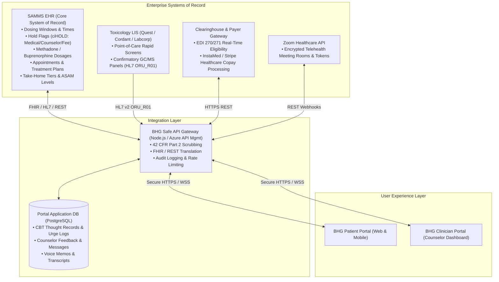
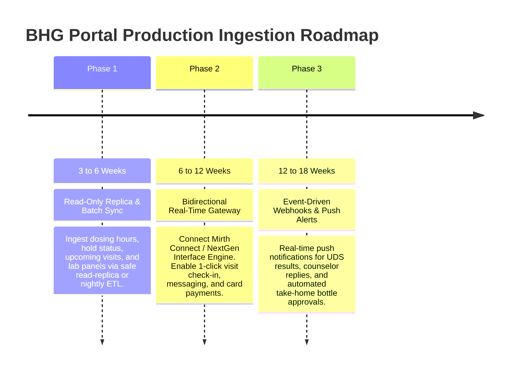

# BHG Patient Portal: Production Data Integration & Architecture Guide

> **Document Purpose**: This document provides the comprehensive, authoritative technical blueprint for how the BHG Patient Portal (and companion Clinician Portal) ingests, processes, and synchronizes live healthcare data when transitioning from this prototype to an enterprise production environment.  
> 🗄️ **Database Field-by-Field Reference**: For exact SQL table names and column mappings from `BHG_DR` / SAMMS, see [DATABASE_TABLE_MAPPING_GUIDE.md](DATABASE_TABLE_MAPPING_GUIDE.md).

---

## Executive Summary: How We Get The Data

A common concern when evaluating digital health applications is: **"Where does this data come from, and how do we connect to it live without compromising security or rewriting clinic workflows?"**

The **BHG Patient Portal** is architected as an **intelligent engagement layer** (a digital front door). It does **not** replace BHG's core systems of record; instead, it interfaces with existing enterprise platforms through a secure, HIPAA-compliant, and **42 CFR Part 2**-compliant **Integration Gateway**.

```
[ Patient Mobile/Web App ]   <--->   [ BHG Safe API Gateway ]   <--->   [ SAMMS EHR / LIS / Clearinghouse ]
[ Clinician Web Portal   ]             • OAuth2 / JWT Auth                • SAMMS Dispensing & Dosing
                                       • Field-level Redaction            • Lab Toxicology Feeds (HL7)
                                       • 42 CFR Part 2 Consent            • Payer Eligibility & Claims
                                       • Redis Cache & Rate Limit         • Zoom Healthcare Telehealth
```

---

## 1. Enterprise Systems of Record (Where the Data Actually Lives)

In BHG's daily operational footprint across 120+ Opioid Treatment Programs (OTPs) in 21 states, data resides across four primary enterprise systems:



### 1.1 SAMMS (Substance Abuse Management System)
* **What it is**: BHG’s primary Electronic Health Record (EHR) and certified methadone/buprenorphine dispensing engine.
* **Core Data Tables**:
  * `tbl_CHECKIN`: Patient arrival queue, dispensing timestamp, and **`ciHOLD`** flag (indicates whether a medical, counselor, or fee hold prevents medication).
  * `tbl_PATIENT`: Demographics, primary counselor assignment, emergency contacts, clinic location, treatment start date.
  * `tbl_MEDICATION`: Dosage amounts (e.g., *Methadone 85mg daily*), dosage history, prescription dates.
  * `tbl_SCHEDULE`: Appointments for counseling, doctor annual physicals, treatment plan reviews, and group therapy.
  * `tbl_TAKEHOME_SCHEDULE`: Approved take-home bottle tiers (Step 1 through Step 6), call-back random inspection dates.

### 1.2 Reference Toxicology Laboratories (LIS)
* **What it is**: External toxicology labs (e.g., Quest Diagnostics, Labcorp, Cordant Health Solutions) and on-site analyzers.
* **Core Data**: Presumptive 10-panel / 14-panel cup screens and certified Gas Chromatography/Mass Spectrometry (GC/MS) or LC-MS/MS confirmatory panels.
* **Format**: Ingested via standard **HL7 v2 (ORU_R01)** or **HL7 FHIR `DiagnosticReport`** feeds.

### 1.3 Billing Clearinghouse & Payment Processor
* **What it is**: Medicaid (TennCare, BlueCare, etc.) and commercial payer gateways (EDI 270/271 real-time eligibility) coupled with healthcare merchant processors (**InstaMed**, **Authorize.Net**, or **Stripe Healthcare**).
* **Core Data**: Copay balances, self-pay dues, insurance card OCR verification, payment receipts.

### 1.4 Dedicated Portal Application Database
* **What it is**: A cloud-hosted, encrypted PostgreSQL / Azure Cosmos DB managed specifically for portal-native interactions.
* **Why it exists**: Prevents cluttering the clinical EHR with informal mobile app interactions:
  * CBT thought records, urge-surfing logs, and homework submissions.
  * Counselor feedback notes on CBT practice.
  * Patient-to-counselor direct messages, audio recordings, and speech-to-text transcriptions.
  * Mobile push notification tokens and user notification preferences.

---

## 2. Feature-by-Feature Data Ingestion Matrix

| Feature in Portal | Live Data Source | Ingestion Mechanism & Transformation |
| :--- | :--- | :--- |
| **"No Holds Active" Status** | SAMMS `tbl_CHECKIN.ciHOLD` | **Real-Time Query**: When the portal loads, it checks `ciHOLD`. If `0`, it renders the green shield (*"No holds active"*). If $>0$, it queries the hold reason (e.g., *Counselor Meet Required*, *Medical Review Overdue*) and displays the appropriate action badge. |
| **Dosing Windows & Hours** | SAMMS Clinic Master Schedule | **Cached Daily**: Ingests the clinic's operating schedule (e.g., *Mon–Fri 5:00 AM – 10:30 AM, Sat 6:00 AM – 9:30 AM*). Adjusts dynamically for holidays or clinic emergency notices. |
| **Upcoming Counseling Visit** | SAMMS `tbl_SCHEDULE` | **Sync Engine**: Ingests scheduled appointments. For telehealth sessions, the gateway calls Zoom Healthcare API to generate an encrypted room URL with single-use tokens. |
| **One-Click Visit Check-In** | SAMMS Check-In API | **Write-Back Event**: When the patient clicks **"Check In"** (within 1 hour of session), the gateway writes an arrival event into SAMMS, updating the counselor’s schedule agenda to **"Checked In / Waiting Room"**. |
| **Recovery Progress & Milestone Badges** | SAMMS Phase Engine | **Rule Evaluation**: Evaluates days enrolled, attendance percentage, and consecutive clean UDS screens against SAMHSA 42 CFR Part 8 criteria to calculate phase (*Induction, Stabilization, Maintenance*) and step level (*Step 3 / 3-Day Take-Home*). |
| **Urine Drug Screen (UDS) Results** | Lab LIS (HL7 ORU_R01) | **HL7 Parser / FHIR Gateway**: Raw technical lab outputs (e.g., *OPIATE: Negative (<300 ng/mL), METHADONE: Prescribed Positive*) are translated into patient-friendly, non-stigmatizing green and amber UI badges. |
| **Between-Session CBT Practice** | Portal PostgreSQL DB | **Portal-Native**: Patients record triggers, urge intensity, and coping strategies directly in the portal. A summary progress snippet is formatted and delivered to the counselor's chart. |
| **Bidirectional Messages & Voice Notes** | Portal DB + WebSockets | **Real-Time WSS**: Messages between patient and clinician travel over encrypted WebSockets. Voice memos are stored in private Azure Blob/S3 storage with server-side AES-256 encryption. |
| **Billing, Dues & Insurance Upload** | Payer Gateway + InstaMed / Stripe | **PCI-DSS Gateway**: Outstanding dues are pulled from SAMMS accounts receivable. Payments processed in-portal return an authorization code that reconciles the balance in SAMMS. |

---

## 3. Recommended 3-Phase Implementation Roadmap

To move from this working POC to live production smoothly without disrupting ongoing clinic operations, follow this phased approach:



### Phase 1: Read-Only Bridge (Fastest: 3 to 6 Weeks)
* **Mechanism**: Deploy an automated hourly/overnight sync from a SAMMS **read-replica database** into the portal cache.
* **Deliverables**:
  * Patients view live dosing hours, hold statuses, upcoming appointments, and past lab screens.
  * Zero risk to SAMMS performance or data integrity because no write operations occur on the primary database.

### Phase 2: Bidirectional Integration Gateway (6 to 12 Weeks)
* **Mechanism**: Stand up an intermediate API Gateway using an enterprise interface engine (e.g., **Mirth Connect / NextGen Connect** or **Azure Health Data Services**).
* **Deliverables**:
  * Real-time 1-click visit check-in written directly to counselor agendas.
  * Direct copay and dues payment processing via InstaMed / Stripe Healthcare.
  * Appointment reschedule requests triaged into counselor work queues.

### Phase 3: Event-Driven Push & Clinical Notifications (12 to 18 Weeks)
* **Mechanism**: Configure webhook emitters / Azure Service Bus messaging for instant event publishing.
* **Deliverables**:
  * Native push notifications sent to patient smartphones when lab results post, appointments are rescheduled, or counselor messages arrive.
  * Automatic hold clearance notifications ("*Your counselor has cleared your hold—you are clear to dose until 10:30 AM*").

---

## 4. Privacy, Security & Regulatory Compliance

Opioid Treatment Programs operate under unique, strict federal protections that go beyond standard HIPAA:

```
                  ┌────────────────────────────────────────┐
                  │          42 CFR Part 2 Shield          │
                  └──────────────────┬─────────────────────┘
                                     │
         ┌───────────────────────────┴───────────────────────────┐
         ▼                                                       ▼
[ Patient Consent Engine ]                              [ Field-Level Redaction ]
Ensures SUD treatment data cannot                       Strips raw Social Security numbers,
be shared with external health systems                  SAMMS internal GUIDs, and doctor notes
without explicit patient e-signatures.                  before payload reaches the browser.
```

### 4.1 42 CFR Part 2 (Confidentiality of Substance Use Disorder Records)
* **Strict Disclosure Prohibition**: Under 42 CFR Part 2, SUD treatment records cannot be shared with employers, law enforcement, or external non-SUD healthcare networks without explicit, granular patient consent.
* **Segregation of Data**: The API Gateway strictly enforces that SUD treatment data is only delivered to authenticated patients and their designated BHG clinical team members.

### 4.2 Data Protection in Transit and at Rest
* **In Transit**: All API communication requires TLS 1.3 encryption with certificate pinning on mobile clients.
* **At Rest**: Database volumes and file storage (audio memos, insurance card photos) are encrypted using AES-256 with customer-managed keys (CMK).
* **Authentication**: Multi-factor authentication (SMS OTP or biometric WebAuthn) for patient logins, and Single Sign-On (Azure AD / Okta) for clinicians.

---

## 5. Executive Takeaway for Stakeholders

> **Key Talking Point for Leadership**:
> *"We do not need to replace or rewrite SAMMS. The BHG Patient Portal operates as an intelligent presentation and engagement layer. By connecting our secure API gateway to SAMMS and our lab feeds, patient data flows automatically in real-time. Patients get instant access to dosing windows, lab results, and appointments, while staff eliminate hours of manual check-in phone calls and paperwork."*
