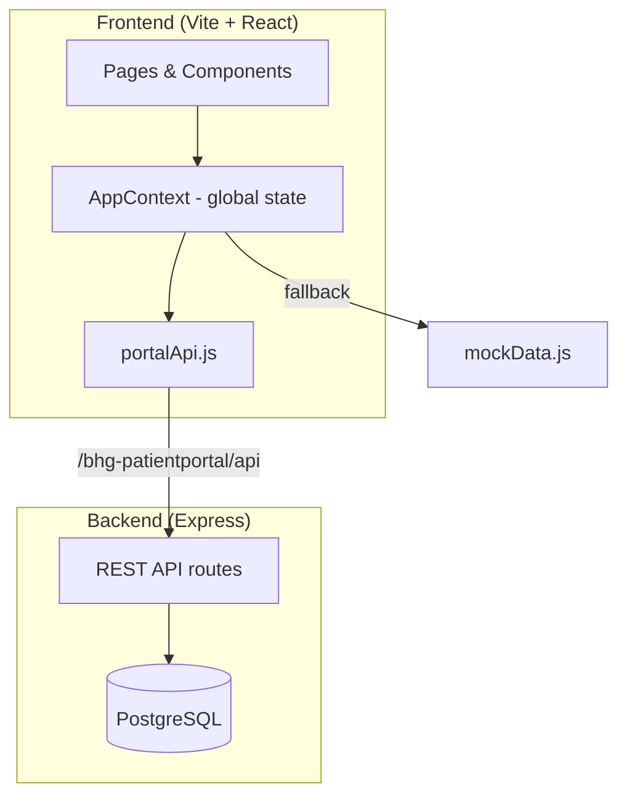

# Code base and project overview
_Exported on 9/15/2026 at 18:49:37 CDT from Cursor (3.17.19)_

---

**User**

explain the code base and project 

---

**Cursor**

I'll explore the repository structure and key config files to map how the project is organized and what it does.


# BHG Med Patient Portal — Project Overview

This is a **proof-of-concept (POC) healthcare portal** for **BHG Behavioral Health**. It demonstrates a unified patient experience: medical records, appointments, surgery prep, billing, messaging, and role-based views for patients, doctors, and admins. It is part of a larger BHG Med demo platform and is meant to be opened from a platform landing page.

---

## What It Does

The portal simulates a real patient portal with three distinct experiences:

| Role | Demo account | Default landing page |
|------|--------------|----------------------|
| **Patient** | `patient@demo.com` | Dashboard — care overview, surgery journey, records |
| **Doctor** | `doctor@demo.com` | Clinical Desk — patient roster, schedule, labs |
| **Admin** | `admin@demo.com` | Command Center — operations, alerts, audit logs |

Password for all accounts: `Password123`

The patient experience is the most fully built out, including a **surgery journey** (pre-op checklist, care team, what to expect) and demo AI features (symptom triage, chatbot assistant).

---

## Architecture



**Data strategy (hybrid):**
- **Primary:** PostgreSQL via the Express API (`portal_bundle`, `portal_users`, `portal_appointments`, etc.)
- **Fallback:** Rich local mock data in `mockData.js` when the API is offline or for doctor/admin views
- **Patient-specific data:** Loaded from the DB when a patient has a `workflow_patient_id` linked to other BHG apps (appointments, pre-op agents)

---

## Tech Stack

| Layer | Technology |
|-------|------------|
| Frontend | React 18, Vite 5, React Router v6, Lucide icons |
| Backend | Express (Node ESM), `pg` for PostgreSQL |
| Database | PostgreSQL (`BHG_appointments` / shared with other BHG POC apps) |
| State | React Context API (`AppContext`) |
| Styling | Plain CSS (`theme.css`, `index.css`) |

**Local URLs:**
- Frontend: `http://localhost:5174/bhg-patientportal/`
- API: `http://localhost:4100` (proxied through Vite at `/bhg-patientportal/api`)

---

## Project Structure

```
packages/
├── frontEnd/                    # React SPA
│   ├── src/
│   │   ├── pages/               # 30+ feature pages (Dashboard, Records, MySurgery, etc.)
│   │   ├── components/          # Layout, Sidebar, Topbar, ChatbotWidget, modals
│   │   ├── context/AppContext.jsx # Auth, portal data, navigation, toasts
│   │   ├── lib/                   # API client, auth, AI demo, symptom triage, billing
│   │   └── data/mockData.js       # Fallback seed data
│   └── vite.config.js             # Base path + API proxy
│
└── backend/
    └── index.js                   # Express API (auth, bundle, CRUD endpoints)
```

**Docs at repo root:**
- `README.md` — setup and run instructions
- `PROJECT_OVERVIEW.md` — feature descriptions
- `REQUIREMENTS.md` — original POC spec (RBAC, AI summary, integration layer goals)
- `docs/PATIENT_PORTAL_DEMO_SCRIPT.md` — spoken demo guide for meetings

---

## Key Frontend Concepts

### Routing & auth

`App.jsx` uses React Router with a base path of `/bhg-patientportal/`. Routes are protected by role:

```148:169:packages/frontEnd/src/App.jsx
function RequireAuth({ children }) {
  const { isLoggedIn } = useApp();
  if (!isLoggedIn) return <Navigate to="/login" replace />;
  return children;
}
// ...
function PortalPage() {
  const { currentPage } = useApp();
  return (
    <Layout>
      {PAGES[currentPage] || <Dashboard />}
    </Layout>
  );
}
```

Auth is persisted in `localStorage` via `authSession.js`. Login tries the API first, then falls back to hardcoded demo accounts.

### Role-based navigation

`Sidebar.jsx` renders different nav items per role — patients see surgery/checklist/records; doctors see roster/schedule/labs; admins see command center, alerts, audit.

### Global state

`AppContext.jsx` is the central hub. It:
- Manages login/logout and session restore
- Fetches `portal/bundle` from the API on login
- Merges API data with local mock seed data
- Handles appointment/billing mutations
- Drives navigation, notifications, and toasts

---

## Backend API

The Express server in `packages/backend/index.js` exposes:

| Endpoint | Purpose |
|----------|---------|
| `POST /auth/demo-login` | Authenticate against `portal_users` table |
| `GET /portal/bundle` | Full data bundle for a user (role-aware) |
| `GET/PATCH /portal/appointments` | Read/update appointments |
| `GET/PATCH /portal/checklist` | Pre-op checklist items |
| `GET/PUT /portal/billing` | Billing data |
| `GET /portal/roster`, `/portal/labs` | Doctor/admin data |

Patient data is scoped by `workflow_patient_id` in `portal_users`. Doctors and admins get a global bundle from `portal_bundle`.

---

## Feature Highlights

**Patient-facing:**
- Dashboard with care-at-a-glance cards
- **My Surgery** + **Pre-Op Checklist** — surgery journey workflow
- Medical records (labs, imaging, prescriptions, visit summaries)
- Appointments, messages, medications, billing/statements
- **Symptom Check** — demo triage logic (`symptomTriage.js`)
- **Chatbot widget** — AI-style assistant (`aiDemo.js`)
- Care timeline, insurance, access log, notifications

**Doctor-facing:**
- Clinical desk, patient roster, daily schedule, lab reports, messaging

**Admin-facing:**
- Command center, operational calendar, alert center, claims/revenue, pharmacy inventory, audit logs, system settings

---

## How to Run

```bash
# Terminal 1 — API
cd packages/backend
cp .env.example .env   # set DATABASE_URL
npm install && npm run dev

# Terminal 2 — Frontend
cd packages/frontEnd
cp .env.example .env
npm install && npm run dev
```

Then open `http://localhost:5174/bhg-patientportal/login`.

---

## POC Intent vs. Current State

`REQUIREMENTS.md` describes the original goals:
- RBAC with backend enforcement
- API-driven data (not static UI mocks)
- Integration-ready architecture (EMR, labs, devices)
- One AI feature (medical summary from doctor notes)

The implementation has **grown beyond the original scope** — it now includes billing, messaging, surgery workflows, symptom triage, and a chatbot — while still operating as a demo with mock/fallback data and simplified auth (no JWT yet; email/password checked directly in Postgres).

---

## Summary

This is a **demo-ready, role-based healthcare portal POC** for BHG Med. It combines a rich React frontend with a lightweight Express/PostgreSQL backend, designed to showcase platform thinking, integration readiness, and a polished patient surgery journey — suitable for stakeholder demos and as a foundation for a production Azure-based platform.

If you want to go deeper on any area — auth flow, data model, a specific page, or how to extend it — say which part and we can walk through it.

---

**User**

is it interconnected to any other app ?

---

**Cursor**

I'll search the codebase for references to other apps, shared databases, and integration points.


Yes — but only **indirectly**, not through live app-to-app API calls in this repo.

## How it connects to other apps

### 1. BHG Med Platform Landing (navigation only)

The README says this portal is opened from a sibling app, **`bhg-med-platform-landing`**, and login can return to **`/bhg-medplatform/`**. That is a **host-level link** between demos on the same site (e.g. `uat.seanergy.ai`), not a code dependency inside this repo.

### 2. Shared PostgreSQL database (the real integration)

The main connection is a **shared Postgres database** (`BHG_appointments`). The README notes it is shared with:

- **Appointment agent apps**
- **Pre-op agent apps**

Those apps write into tables like `surgeries` and `pre_ops`. This portal reads/writes its own tables:

| Portal tables | Purpose |
|---------------|---------|
| `portal_users` | Demo login + `workflow_patient_id` link |
| `portal_bundle` | Cached JSON bundles per patient |
| `portal_patients`, `portal_appointments`, `portal_checklist_items` | Patient-specific synced data |
| `portal_billing`, `portal_roster`, `portal_labs` | Other portal data |

The glue field is **`workflow_patient_id`** on `portal_users`. When set, the backend loads that patient’s appointments, checklist, and surgery data from the shared DB:

```92:101:packages/backend/index.js
  if (user.workflow_patient_id) {
    const patientBundle = await getPatientBundle(user.workflow_patient_id);
    return {
      ...patientBundle,
      workflowPatientId: user.workflow_patient_id,
      hasSyncedPatient: Boolean(
        patientBundle.patient ||
          (Array.isArray(patientBundle.appointments) && patientBundle.appointments.length)
      ),
    };
```

So the intended flow is:

```text
Pre-op AI phone agent  ──writes──▶  BHG_appointments DB
Appointment agent      ──writes──▶  BHG_appointments DB
                                        │
                                        ▼
                              Patient Portal reads via workflow_patient_id
```

The UI reflects that story — e.g. **My Surgery** shows:

> “No surgery has been synced to your portal yet. Complete your pre-op call first, then sign in again…”

And the timeline includes events like **“Intake Completed via AI Agent”** (AI phone call).

### 3. Same deployment host

In production/UAT, it runs alongside other BHG demos:

- Platform: `https://uat.seanergy.ai/bhg-medplatform/`
- This portal: `https://uat.seanergy.ai/bhg-patientportal/`

Same host, different paths — not a monorepo or shared npm packages.

---

## What is **not** interconnected

| Area | Reality in this codebase |
|------|---------------------------|
| **Direct API calls to other apps** | None — no HTTP clients to appointment/pre-op agents |
| **Real-time sync / webhooks** | None — pull-on-login from Postgres |
| **EMR integrations (Epic, LabCore, etc.)** | Mock UI in Admin Dashboard only |
| **External AI (OpenAI, etc.)** | Client-side demo logic (`aiDemo.js`, `symptomTriage.js`) |
| **Integrations page** | Redirects to Admin Dashboard; data is simulated |

Most of the UI still works from **`mockData.js`** when the API is down or the patient has no `workflow_patient_id`. Doctor/admin views use mock data more heavily; patient views use live DB data when synced.

---

## Summary

**Yes, it is designed to be part of a larger BHG Med demo ecosystem**, connected mainly by:

1. **Shared database** with appointment and pre-op agent apps via `workflow_patient_id`
2. **Platform landing page** for navigation between demos
3. **Shared UAT host** (`uat.seanergy.ai`)

It is **not** a tightly coupled microservice mesh. Integration is **database-centric and demo-oriented**: other apps write patient workflow data; this portal reads it on login. Everything else (EMR, labs, messaging backends) is simulated in the UI for the POC.

If you want, I can trace exactly what happens when `patient@demo.com` logs in with vs. without a linked `workflow_patient_id` in the database.

---

**User**

run this application 

---

**Cursor**

I'll check the project setup and start the backend and frontend dev servers.


Dependencies aren't installed yet. I'll set up env files, install packages, and start both servers.


The application is running.

### Servers

| Service | URL | Status |
|---------|-----|--------|
| **Frontend** | [http://localhost:5174/bhg-patientportal/](http://localhost:5174/bhg-patientportal/) | Running |
| **Backend API** | `http://localhost:4100` | Running (DB connected) |

### Login

Open the frontend URL above, then sign in with:

| Role | Email | Password |
|------|-------|----------|
| Patient | `patient@demo.com` | `Password123` |
| Doctor | `doctor@demo.com` | `Password123` |
| Admin | `admin@demo.com` | `Password123` |

### What was set up

- Installed npm dependencies for both `packages/backend` and `packages/frontEnd`
- Created `.env` files (backend uses the shared demo Postgres database)
- Started both dev servers in the background

The frontend should have opened in your browser automatically. If not, use the link above.

To stop the servers later, close those terminal sessions or press `Ctrl+C` in each one.

---

**User**

great it got started but all the information that was coming here is it coming fromdatabase or what ?

---

**Cursor**

I'll trace where the dashboard data comes from — checking the API response, mock fallbacks, and how the patient login merges them.


The screenshot shows surgery details that aren't in the mock files — I'll query the live API to confirm what's coming from the database.


**Short answer:** what you’re seeing is a **mix** — surgery-related data is coming from the **PostgreSQL database**; most of the rest is still **local mock data** baked into the frontend.

---

## How data loads when you log in

When you sign in as `patient@demo.com`, this happens:

1. **Auth** → API checks `portal_users` in Postgres  
2. **Bundle fetch** → API loads patient data keyed by `workflowPatientId: 23234`  
3. **Merge** → `AppContext` overlays DB fields onto `mockData.js`

```98:110:packages/frontEnd/src/context/AppContext.jsx
  const applyBundle = useCallback((bundle, { isPatientWithSync = false, isPatient = false } = {}) => {
    const useRealPatientData =
      isPatientWithSync ||
      bundle?.hasSyncedPatient ||
      (Array.isArray(bundle?.appointments) && bundle.appointments.length > 0);

    const next = { ...localSeed };
    if (useRealPatientData) {
      next.patient = bundle?.patient ?? null;
      next.appointments = Array.isArray(bundle?.appointments) ? bundle.appointments : [];
      next.preOpChecklistItems = Array.isArray(bundle?.preOpChecklistItems) ? bundle.preOpChecklistItems : [];
      next.visits = Array.isArray(bundle?.visits) ? bundle.visits : [];
      next.timelineEvents = Array.isArray(bundle?.timelineEvents) ? bundle.timelineEvents : [];
```

It starts with **all mock data**, then replaces specific fields when the DB has synced patient data.

---

## What on your dashboard is from the database

I queried the live API for your session. These match what’s on screen:

| UI element | Source | DB value |
|------------|--------|----------|
| **Surgery banner** (“22 days — Oct 3/4, 2026”) | DB | `Gall bladder Surgery` with **Kim**, Oct 4 2026 |
| **Pre-Op Checklist** (3 of 6) | DB | Same 6 tasks, 3 marked done |
| **Visits** (“Pre-op AI screening…”) | DB | Sept 7, 2026 visit with Kim |
| **Patient name** (Sarah Jenkins) | DB | `portal_users` + `portal_patients` |
| **Login / MRN** | DB | `MRN-23234`, linked to pre-op workflow |

That surgery data (**Gall bladder Surgery / Kim / October 2026**) is **not** in `mockData.js`. Mock data uses **Laparoscopic Cholecystectomy / Dr. James Chen / June 2026**. So your screen is definitely showing **live DB data** for the surgery workflow — likely written by the **pre-op AI agent** into the shared `BHG_appointments` database.

---

## What is still mock / hardcoded

These cards do **not** come from the DB bundle for patients:

| UI element | Source |
|------------|--------|
| **Messages** (3 unread) | `mockData.js` → `conversations` |
| **My Records** (11 documents) | `mockData.js` → `records` |
| **Statements** (1 statement, $0 balance) | `mockData.js` → `billing` |
| **Medications** (“3 active”, Lisinopril warning) | Hardcoded in `Dashboard.jsx` (`activeMeds = 3`) |
| **Care Team** (Marie Laurent, Dr. James Chen, Lisa Park) | Hardcoded in `Dashboard.jsx` |
| **Notifications, help, insurance details, etc.** | Mostly `mockData.js` |

---

## Visual breakdown

```text
┌─────────────────────────────────────────────────────────┐
│  FROM DATABASE (Postgres via API)                       │
│  ✓ Surgery date & procedure                             │
│  ✓ Pre-op checklist                                     │
│  ✓ Visits / timeline                                    │
│  ✓ Patient profile basics                               │
├─────────────────────────────────────────────────────────┤
│  FROM mockData.js (frontend fallback)                   │
│  ○ Messages, records, billing                           │
│  ○ Most notifications & account pages                   │
├─────────────────────────────────────────────────────────┤
│  HARDCODED in Dashboard.jsx                             │
│  ○ Medications count & Lisinopril note                    │
│  ○ Care team names                                      │
└─────────────────────────────────────────────────────────┘
```

---

## Why it works this way

The POC was built so that:

- **Surgery workflow data** (from the appointment/pre-op agents) syncs through the shared DB via `workflow_patient_id`
- **Everything else** still uses rich mock data so the demo looks complete without wiring every module to Postgres

If the API were down, **patient login would fail entirely** — patients can’t fall back to mock-only mode. Doctor/admin accounts can still use mock data if the API is unavailable.

---

**Bottom line:** The surgery-centric content on your dashboard (countdown, checklist, visits) is **real database data** tied to workflow patient `23234`. Messages, records, billing, medications, and care team on that same screen are **mock or hardcoded** for the demo.

Want me to trace which other pages (Messages, Records, My Surgery, etc.) are DB vs mock?

---

**User**

what i want to say is what ever that we have done the code and stuff this is done for other customer not for bhg we just chnaged titles and stuff like that and logo we did this for medical concepts not for bhg just letting you know...

---

**Cursor**

Good to know — that reframes the project clearly.

**What you're describing:** This is a **rebranded medical patient-portal POC**, not a greenfield BHG build. The core app (surgery journey, pre-op checklist, role-based portal, shared DB integration pattern) was done for **another customer / medical use case**. BHG is mainly **presentation** — logo, names, and copy — layered on top.

That matches what’s in the code:

- **`AppContext.jsx`** still has a `brandSeed()` helper that rewrites old names (e.g. “Ottawa ASC”) → “BHG Behavioral Health”
- **`mockData.js`** still has original medical concepts (surgery workflow, labs, billing, care team) with BHG labels applied in places
- **Docs/README** talk about “BHG Med” because of the rebrand, not because the architecture was designed only for BHG
- The **integration model** (shared Postgres, `workflow_patient_id`, pre-op agent sync) is a generic medical POC pattern, not BHG-specific business logic

So when we discuss this project, it’s fair to say:

| Layer | Reality |
|-------|---------|
| **Functionality** | General medical / surgical patient portal POC |
| **Original customer** | Someone else (pre-BHG) |
| **BHG** | Branding, titles, logo, demo narrative |
| **Data** | Mix of DB-synced workflow data + rich mock medical data |

I’ll keep that in mind going forward — e.g. when you’re demoing, documenting, or extending it, we can treat it as a **reusable medical portal template** rather than a BHG-only product.

If you want, I can also help you strip remaining “BHG-only” wording from docs/comments, or list what still looks like the original customer branding in the UI.

---

**User**

we want bhg style things now before doing anything i just want you to understandthe Business domain of bhg for that i have documented few things @Documents  can you do through this deeply...

---

**Cursor**

I'll read the BHG documents in depth first so I understand the business domain before we change anything.

The domain docs are substantial. I'll read all three end to end, starting with the overview, then the NexaVoice BRD, then the counselor notetaker guide.

The overview and NexaVoice BRD are in. Next I’ll read the counselor notetaker guide in full — that’s the clinical operating detail.

I went through all three documents in `Documents/` end to end. I will not change the portal yet. Here is the BHG domain as I now understand it, and how it differs from the rebranded medical/surgery POC we have today.

---

## Who BHG actually is

**Behavioral Health Group** is a Dallas-based **outpatient addiction-treatment company**, not a hospital, not a surgery center, and not a general “patient portal for labs and billing.”

They run the largest Joint Commission–accredited **outpatient opioid treatment** network in the U.S.:

- ~110–118 clinics across 20+ states
- ~42,000 patients **every day**
- Patients live at home and come to a clinic (often **daily at first**) for months or years

The product is **recovery as a long-stay outpatient operating system**: medication + counseling + labs + case management. The unit of value is a **retained, reimbursed patient-day** (or patient-week), not a one-time procedure.

---

## The clinical product (what “care” means here)

BHG sells **evidence-based outpatient recovery**, not a pill and not a surgery journey.

1. **MOUD / MAT** — methadone, buprenorphine (Suboxone, Brixadi, Sublocade), naltrexone (Vivitrol). They position themselves as one of the few programs offering all three FDA-approved OUD medications.
2. **Counseling** — individual and group (CBT, motivational interviewing, contingency management). Required on a schedule. In SAMMS this is **Darts**.
3. **Case management** — housing, jobs, Medicaid, transportation, family support.
4. **Toxicology / labs** — scheduled and random **UDS/UA**. Continuous, not occasional.
5. **IOP** at some sites — more therapy hours when acuity is higher.

Two regulated settings, often in the **same building**:

| Setting | What it is | Why it matters |
|---------|------------|----------------|
| **OTP** | Federally certified clinic that **dispenses methadone on site**. Observed dosing, take-homes, diversion control, counseling, UA. | Highest volume. Highest regulation. Often billed as a **daily/weekly bundle**. This is the “dosing window” business. |
| **OBOT** | Office setting that **prescribes** buprenorphine/naltrexone; fill may be at a pharmacy. | Looks more like normal medical + BH billing. Lower daily foot traffic. |

Programs in the NexaVoice BRD match that: **OTP, OBOT, MMT/methadone, IOP, injectables, Subutex, Brixadi, Sublocade, Vivitrol, SUD**.

The current portal’s “My Surgery / Pre-Op Checklist / gall bladder / escort / fasting” is a **different industry**. BHG’s analog of “the next big event” is **today’s dose**, not an operating-room date.

---

## How a clinic actually runs (the operating system)

A BHG clinic day is a **factory of visits**, not a doctor’s appointment book.

```
Walk-in / call center / Salesforce
        → Intake / PPA (same-day / next-day goal)
        → Medical exam + counselor + consents
        → First dose (often same day)
        → Daily loop for weeks to years:
              Check-in → queue → dosing window → dose
              (sometimes UA, counseling, provider visit)
              take-homes if earned
        → Periodic reassessment / treatment plan
        → Discharge, transfer, or restart
```

**Census** (open enrollment, still treating) is the #1 operating KPI — not “upcoming appointments.”

Holds are a first-class concept: **no counseling / unpaid / positive UA / clinical lock → hold at the window → no dose**. That is how OTP rules show up in the clinic.

---

## Patient journey in BHG language

**Finding BHG:** call 844-535-7291, walk in, location finder. CRM (Salesforce) sits **outside** SAMMS.

**First day (2–3 hours):** photo ID, insurance, medical exam, **COWS** withdrawal scoring, counselor interview across **six ASAM dimensions**, substance-use history, consents (42 CFR Part 2), pregnancy protocol if needed, financial setup, **same-day first medication**.

**Enrollment = on census.** One person can have many episodes (discharge → relapse → restart). ~879K enrollment rows vs ~42K daily patients.

**Daily life:** check-in (largest table in their warehouse) + standing **order** (MD instruction) + **dose** (nurse dispense) + sometimes counseling.

**Appointments ≠ check-in.** A stable methadone patient may check in 20+ times a month and have only 2–4 counselor/provider appointments.

**Monitoring:** UA, BAM, periodic ASAM reassessment, take-home risk assessments. Positive UA / missed doses / missed counseling typically **pull take-homes back** (patient must come daily again).

**Money runs in parallel** with care: eligibility, payer assignment, prior auth, self-pay weekly fee, hardship / **FMP** (keep dosing while catching up).

**Discharge / transfer / guest dosing:** national network so a Kentucky patient can dose in Tennessee while traveling.

---

## Roles (who the portal would actually serve)

This is the BHG cast, not patient / surgeon / hospital admin:

| Role | Job |
|------|-----|
| **Patient** | Come to clinic (often daily), take observed meds, attend counseling, complete UDS, manage copay/self-pay, earn take-homes |
| **Front desk** | Check-in, payments, identity at the window (photo/fingerprint — diversion control) |
| **Dosing nurse** | Observe swallow, log dose, issue take-home bottles, inventory |
| **Counselor** | Caseload, required session frequency, ASAM, DAP/PIE notes, engagement |
| **Medical provider / MD** | Orders, dose titration, pregnancy, E&M, take-home decisions |
| **Patient financial counselor** | Eligibility, auth, hardship, FMP |
| **Biller / AR** | Claims, denials, weekly bundles |
| **Clinic director** | Today’s census, wait time, holds, staffing, compliance |
| **Contact-center agent** | Find a center, program, hours, insurance, cost — NexaVoice’s audience |

---

## How BHG makes money

Not retail pharmacy. Not inpatient bed-days. **Outpatient healthcare reimbursement.**

Two ledgers:

- **Patient ledger** (`tbl_Bills`) — cash/copay at the window, weekly self-pay
- **Insurance ledger** (`tbl_Claims` + line items) — Medicaid (largest OTP payer, often **bundled daily/weekly rate** covering meds + counseling + support), Medicare, commercial

What they optimize: **inflow → conversion to first dose → retention/census → clean claims → window throughput / counselor caseload**.

Access products (**FMP, hardship**) exist because **a missed week of payment should not automatically become a missed week of methadone**.

---

## How the three documents fit together

They are **three layers of the same company**, not three unrelated products.

**1. `BHG_Business_Domain_End_To_End.md`** — the company operating system  
Who BHG is, OTP vs OBOT, clinic day, patient life cycle, SAMMS tables, census, dosing, Darts, UA, claims vs bills. This is the source of truth for “what is BHG.”

**2. `BHG_nexavoice_brd.txt`** — the **front door / knowledge platform** for agents  
Problem: center, staff, insurance, cost, hours, holidays, programs are fragmented, so intake guidance is slow and error-prone.  
In scope: treatment-center lookup, staff, program costs (MMT, OBOT, etc.), payors, templates, drug repository, holidays, FAQ, org chart, admin roles.  
Out of scope: EMR integration, real-time booking, live eligibility.  
Success: agent finds a center and verifies program/insurance in **under 2 minutes**.

**3. `BHG_A_Notetaker_Counselor_Guide.txt`** — the **counselor documentation product**  
Counseling is a **required OTP service** and usually the **billable insurance unit**. Notes must land in **SAMMS**.  
AI transcribes, nudges (safety, CBT, UDS review, location confirmation, AI disclosure), drafts **DAP** (20 states) or **PIE** (North Carolina only). Counselor reviews, attests, **manually syncs**. SAMMS remains system of record; supervisor co-sign stays in SAMMS. HIPAA, 42 CFR Part 2 sensitivity, Azure AD SSO, no patient-facing features in that app.

Together: **NexaVoice gets the person to the right clinic; the clinic runs dosing + counseling in SAMMS; Notetaker helps counselors document the counseling that both care and billing depend on.**

---

## What this means for *this* portal (alignment only, no build yet)

The current app is a **generic surgical patient portal** with BHG logos. Against this domain, the mismatch is structural, not cosmetic:

| Current POC | Actual BHG |
|-------------|------------|
| Surgery date, fasting, escort, pre-op | Daily/weekly dosing, take-homes, holds |
| Surgeon / hospital admin / care concierge | Counselor, dosing nurse, MD, financial counselor, clinic director |
| One-time procedure journey | Months-to-years retention / census |
| Labs as “records hub” | UA as continuous diversion and adherence control |
| Statements / itemized hospital billing | Weekly bundle + window copay / self-pay / FMP |
| Symptom check / ED triage | COWS, BAM, ASAM, UDS, SI/HI assessed by clinician |
| “My Care Team: surgeon + RN navigator” | Assigned counselor + physician on enrollment |
| Demo login, mock EMR | SAMMS is the EMR; SiteCode + ClientID are per clinic |

A BHG-style patient portal, if we build one later, would be about things like: **next dose / take-home status, counseling appointments, UDS, holds, payment/hardship, assigned counselor, consents, telehealth counseling** — not gall bladder surgery.

I am treating this as the domain baseline for whatever we do next. When you want to start reshaping the portal, we can map screens to BHG journeys (patient vs counselor vs clinic ops vs contact-center agent) instead of re-skinning the surgery template again.

---

**User**

so we still need admin ?

---

**Cursor**

Yes — BHG still needs an **admin-type role**. It should not be the **hospital command-center admin** this portal has today.

BHG “admin” is several jobs, not one person:

| BHG role | What they actually do | Close to current portal “Admin”? |
|----------|------------------------|----------------------------------|
| **Clinic director / ops manager** | Today’s census, window wait, holds, staffing, UA/take-home compliance | Closest match |
| **Patient financial counselor / biller** | Eligibility, auth, hardship, FMP, claims | Only the money part of current Admin |
| **Notetaker Admin** | All counselors’ sessions, notes pending, SAMMS sync rate | Counselor documentation oversight — not a patient-portal home |
| **NexaVoice Admin** | Users, roles, center/staff/payor knowledge | Internal knowledge platform, not patient care |
| **Corporate / PE ops** | Multi-site census, retention, payer mix | Warehouse / analytics, not this POC’s UI |

For **this patient-portal POC**, keep an admin, but treat it as **clinic operations**, not hospital admin.

**Still useful on a demo login**
- Who is on census today, who is on **hold** and why
- Window wait / dosing throughput
- Counseling compliance (Darts due → hold → no dose)
- Staff directory / which counselor is assigned
- Users and roles (patient vs counselor vs provider vs front desk)

**Drop or heavily rewrite from the current Admin screens**
- Hospital “Command Center,” ED census, ICU capacity, pharmacy inventory
- Surgeon assignment, OR calendar, claims-as-hospital-revenue
- Epic / LabCore “integrations” theater

**Doctor vs admin**
BHG’s clinical staff role is closer to **counselor** (and separately **MD/dosing provider**) than a hospital “doctor dashboard.” Admin does **not** replace those. Admin oversees the clinic; counselors and providers do the care.

So: **keep Admin as a role**, rename/reframe it as **clinic ops / treatment-center director**, and stop using it as a generic hospital admin. Patient, counselor (or provider), and clinic admin is a BHG-shaped trio. Front desk / financial counselor can wait unless the demo needs them.

---

**User**

even for counsler we required ?

---

**Cursor**

A **counselor is required in BHG care**. A **counselor login in this portal** is not required unless you want this app to be a staff workspace too.

**In the patient’s world — yes, always**  
BHG treatment does not work without a counselor. OTP rules tie counseling to dosing (`RequireDarts` → hold → no dose). On the patient side you still show:

- assigned counselor  
- upcoming individual/group sessions  
- messages / next appointment  
- that counseling compliance affects take-homes and holds  

That is care-team data, not a counselor product.

**As a logged-in role in *this* app — only if this POC is multi-role**  

Counselors already have their own tools:

| System | Who it’s for |
|--------|----------------|
| **SAMMS** | Schedule, caseload, chart, co-sign |
| **AI Notetaker** | Live session, DAP/PIE notes, sync to SAMMS |
| **This portal** | Meant for the **patient** (and maybe clinic ops) |

The Notetaker BRD even says **direct patient-facing features are out of scope**. So the patient portal should not copy Notetaker (live transcript, nudges, SAMMS sync). That would duplicate a product you already have.

**Practical split for this POC**

| Keep | Skip unless you explicitly want a staff demo |
|------|-----------------------------------------------|
| Patient role | Counselor dashboard that looks like today’s “doctor” desk |
| Clinic admin / director (if you keep admin) | Session recording, note generation, caseload charting |

Replace today’s **Doctor** with **Counselor** only if the demo must show “staff vs patient” in one URL. Even then, keep it thin: today’s caseload, who is on hold, who missed counseling — not a second Notetaker.

**Short answer:** BHG needs counselors. This portal needs to **show the counselor to the patient**. It does **not** need a full counselor app unless you decide this POC is a combined patient + staff portal.

---

**User**

we wanted to bulid a patient portal for bhg can you able to edit the existing repository to do that..? just tell me 

---

**Cursor**

Yes. I can reshape this existing repo into a **BHG patient portal** — keep the React/Express shell, and replace the surgery/hospital content with BHG patient journeys (dosing, counseling, UDS, holds, payments, assigned counselor, clinic ops if we keep admin).

I would not rebuild from scratch. Doctor/counselor staff apps stay out unless you ask for them.

Say when to start and whether you want **patient-only** or **patient + clinic admin**.

---

**User**

whats your plan how you want to do it ? i need this to be perfect..? I have no idea on this so..?

---

**Cursor**

My recommendation is to build a **patient-only BHG portal first**. Counselor and admin tools are separate products and would dilute the patient experience.

“Perfect” requires BHG stakeholder validation, but I can make it domain-accurate, polished, internally consistent, and demo-ready.

## Proposed plan

### 1. Audit what can be reused
Keep:
- React/Vite application shell
- Routing, responsive layout, notifications and authentication structure
- Express API and PostgreSQL access pattern
- General reusable UI components

Replace:
- Surgery, pre-op, surgeon and hospital content
- Hospital command center and doctor workflows
- Current medical mock data
- Misleading BHG branding substitutions

### 2. Define the real BHG patient journey
The portal will focus on:

1. Enroll in treatment
2. View treatment center and hours
3. See next medication visit
4. Understand dosing/take-home schedule
5. View counseling appointments
6. Review UDS status appropriately
7. Complete forms and consents
8. Contact counselor or clinic
9. View insurance, payments, hardship/FMP support
10. Follow recovery progress

We must use supportive, non-stigmatizing language and avoid exposing sensitive clinical details unnecessarily.

### 3. Design the patient navigation

Recommended navigation:

- **Home**
- **My Treatment**
- **Medication Schedule**
- **Appointments**
- **Counseling**
- **Lab & UDS**
- **My Care Team**
- **Messages**
- **Payments & Coverage**
- **Forms & Documents**
- **Recovery Progress**
- **Profile & Privacy**

No surgery, pre-op, OR, surgeon, ICU, or generic hospital terminology.

### 4. Redesign the dashboard

The dashboard should answer the patient’s immediate questions:

- Where and when is my next clinic visit?
- Is today an observed-dose or take-home day?
- Do I have counseling or required forms due?
- Are there any clinic closures or holiday instructions?
- Who is my counselor?
- Do I need to contact the clinic?
- Is insurance or payment action required?

Sensitive statuses such as holds require careful wording. The portal should say **“Contact your treatment center before your next visit”**, not expose punitive or ambiguous language without explanation.

### 5. Build a BHG-specific data model

Create clean frontend and API models for:

- Patient
- Treatment center
- Enrollment
- Medication plan
- Dose schedule
- Take-home schedule
- Appointments
- Counselor/care team
- UDS/lab status
- Required actions
- Insurance and payment summary
- Forms/consents
- Notifications
- Recovery milestones

We should not connect UI components directly to raw SAMMS table names. The backend should translate SAMMS concepts into safe patient-facing API objects.

### 6. Replace mock data first

Before using live systems, I would create one coherent fictional BHG patient story:

- One treatment center
- Assigned counselor and medical provider
- Methadone or buprenorphine treatment plan
- Realistic upcoming counseling appointment
- Take-home schedule
- UDS and forms status
- Coverage/payment scenario
- Recovery milestones

Every page would use the same patient, dates, clinic and treatment plan. This makes the demo believable and avoids contradictions.

### 7. Rebuild pages in phases

**Phase 1 — Core demo**
- Login
- Dashboard
- My Treatment
- Medication schedule
- Appointments
- Care team
- Notifications

**Phase 2 — Supporting care**
- Counseling
- UDS/labs
- Messages
- Forms/documents
- Recovery progress

**Phase 3 — Financial and privacy**
- Insurance/payment summary
- Hardship/FMP help
- Access log
- Consent and privacy controls

### 8. Handle integration correctly

Initially:

```text
BHG Patient Portal
        ↓
Patient-safe Express API
        ↓
Consistent BHG demo data
```

Later:

```text
Portal → API translation layer → SAMMS / approved BHG services
```

The existing shared surgery database should not remain the source for the redesigned experience. Its gall-bladder/pre-op records belong to the previous customer concept.

### 9. Verification

I would verify:

- No surgery/hospital terminology remains
- All dates and patient information agree across pages
- Patient cannot access another patient’s data
- Mobile and desktop layouts work
- Empty/loading/error states are clear
- Accessibility and keyboard navigation
- Sensitive information is displayed safely
- No clinical claims are invented
- BHG terminology matches the supplied documents
- Production build succeeds

### 10. Stakeholder validation

Before calling it final, BHG should validate:

- Which medication/dosing details patients may see
- How holds should be communicated
- Whether UDS results or only status should be exposed
- Take-home terminology and policy
- Messaging boundaries
- Payment/FMP presentation
- 42 CFR Part 2 and consent requirements
- SAMMS integration fields

## Recommended scope

Start with a **patient-only, BHG-specific demo using consistent mock data**. Do not build counselor or admin screens in the first pass. After the patient portal is correct, we can optionally add a small clinic-operations view as a separate experience.

I would proceed carefully, page by page, and show you the running result after each major phase rather than replacing everything blindly.

---

**User**

everything is a static so build now.. take your time..

---

**Cursor**

I’ll rebuild this as a static, patient-only BHG portal. I’ll preserve the reusable React shell and replace the surgery workflow, data model, navigation, pages, and language with BHG-appropriate treatment concepts.

The static BHG redesign is now built and compiles cleanly. I’m moving through browser verification now—login, navigation, content consistency, and responsive layout.

Built the static, patient-only BHG portal.

### Included

- BHG-styled login and navigation
- Treatment summary
- Medication and take-home schedule
- Counseling and appointments
- Lab & UDS follow-up
- Care team and secure messages
- Coverage, payments, forms and privacy
- Recovery goals and milestones
- Treatment-center hours and crisis contacts
- Responsive mobile layout


All displayed information now comes from the coherent static model in `src/data/bhgPatientData.js`. The frontend no longer calls the backend/database.

Verification completed:

- Production build passes
- No linter errors
- Login and navigation tested
- Desktop and mobile layouts tested
- No surgery, pre-op, surgeon, gall-bladder or hospital language remains in active portal files

Refresh [http://localhost:5174/bhg-patientportal/](http://localhost:5174/bhg-patientportal/).

Login: `patient@demo.com` / `Password123`

---

**User**

<timestamp>Monday, Sep 14, 2026, 7:41 AM (UTC-5)</timestamp>
<system_notification>
The following task has finished. If you were already aware, ignore this notification and do not restate prior responses.

<task>
kind: subagent
status: success
task_id: 8f295d81-8305-4db8-9014-9e6fa21334cf
title: Map reusable portal shell
tool_call_id: call_1HCZ4Jfx2zC3XvYfeGVN8Y6n
fc_0587bf32c336c8b0016aa7e911e67087d1b7f35ad2c4681ade
agent_id: 8f295d81-8305-4db8-9014-9e6fa21334cf
detail: <user_visible_high_level_summary>
Explored the React/Vite frontend shell, routing, AppContext, CSS design system, and patient vs admin/doctor split. Key findings: keep `main.jsx`, `index.css`/`theme.css`, and Layout shell; replace `App.jsx`, `AppContext`, nav components, and surgery-focused pages; simplify auth to static patient-only mock data (drop `portalApi`); watch for `getPortalSlice` module-load timing and `addAuditLog` stubs in Records.
</user_visible_high_level_summary>
<response>
## Repository snapshot

**Stack:** React 18 + Vite 5 + `react-router-dom` 6 + `lucide-react` 
**Location:** `C:\Users\tsaty\Downloads\LENS-PoCs-bhg-med-patient-portal-poc\LENS-PoCs-bhg-med-patient-portal-poc\packages\frontEnd` 
**Current scope:** Multi-role POC (patient / doctor / admin) with surgery/pre-op patient flows and optional backend API on port 4100.

---

## 1) Dependencies between inspected files

### Import / runtime graph

```
main.jsx
├── App.jsx
│ ├── context/AppContext.jsx
│ │ ├── data/mockData.js
│ │ ├── lib/authSession.js
│ │ ├── lib/portalApi.js ← API fetch on login
│ │ └── lib/portalData.js ← live cache + getPortalSlice()
│ ├── components/Layout.jsx
│ │ ├── Sidebar.jsx → BhgLogo, AppContext, react-router-dom
│ │ ├── Topbar.jsx → AppContext
│ │ ├── ChatbotWidget.jsx → AppContext + aiDemo, mockData, etc.
│ │ ├── AssignProviderModal.jsx ← admin-only
│ │ └── TriggerAlertModal.jsx ← admin-only
│ ├── pages/Login.jsx → BhgLogo only (auth wired in App.jsx)
│ ├── pages/* (30+ via PAGES map)
│ └── lib/authSession.js (defaultPageForRole)
└── index.css → theme.css
```

### How routing works (non-standard)

The app does **not** use one React Router route per page. Instead:

| Layer | Role |
|--------|------|
| `App.jsx` | Defines `PAGES` map (`currentPage` slug → JSX), guards (`RequireAuth`, `PublicOnly`), single `/:page` route |
| `AppContext` | Owns `currentPage`, syncs URL ↔ slug via `navigate()` + `useEffect` on `location.pathname` |
| `PortalPage` | Renders `<Layout>{PAGES[currentPage]}</Layout>` |

Login path: `Login.jsx` → `onLogin` prop → `App.jsx` `LoginPage` → `useApp().login()` → `navigate('/dashboard')`.

### AppContext consumers (patient-relevant)

| Consumer | Context keys used |
|----------|-------------------|
| `Layout` | `sidebarOpen`, `toasts` |
| `Sidebar` | `currentPage`, `navigate`, `logout`, `userRole`, `user`, admin modals, `hospitalMetrics` |
| `Topbar` | `currentPage`, `navigate`, `unreadCount`, `userRole` |
| Patient pages | `user`, `patient`, `portalData`, `patientAppointments`, `patientBilling`, `notifications`, `conversations`, `records`, `visits`, `timelineEvents`, `preOpChecklistItems`, `insuranceCoverage`, `helpCategories`, `navigate`, `addToast`, `portalBundleLoading`, `portalLoadError`, `refreshPortalData` |
| `ChatbotWidget` | appointments, billing, audit, booking — heavy coupling |
| `Records` | `portalData`, `addAuditLog` |

### Package / build config

- `packages/frontEnd/package.json` — minimal deps; no CSS framework (custom design system).
- `vite.config.js` — `base: /bhg-patientportal/`, dev proxy to `localhost:4100` for API.
- `.env.example` — `VITE_BASE_PATH`, `VITE_PORTAL_API_URL`.

---

## 2) Reusable CSS utilities / classes

The design system in `index.css` + `theme.css` is the main reusable asset. **Keep both files intact**; rebrand via `theme.css` CSS variables only.

### Theme tokens (`theme.css`)

`--primary`, `--accent`, `--bg`, `--surface`, `--border`, `--text-*`, `--sidebar-*`, `--radius-*`, `--shadow-*`, `--transition*`

### Layout shell (high reuse)

| Classes | Purpose |
|---------|---------|
| `.app-shell`, `.main-content`, `.page-content` | App chrome |
| `.sidebar`, `.sidebar-nav`, `.sidebar-item`, `.sidebar-item.active`, `.sidebar-section-label`, `.sidebar-footer`, `.sidebar-user*` | Navigation |
| `.sidebar-overlay` | Mobile drawer |
| `.topbar`, `.topbar-breadcrumb`, `.topbar-title`, `.topbar-subtitle`, `.topbar-actions`, `.topbar-avatar`, `.topbar-icon-btn` | Header |

### Component primitives (used across patient pages)

| Category | Classes |
|----------|---------|
| Cards / stats | `.card`, `.card-header`, `.card-body`, `.stat-card`, `.stat-card-*` |
| Buttons | `.btn`, `.btn-primary`, `.btn-secondary`, `.btn-ghost`, `.btn-danger`, `.btn-sm`, `.btn-full` |
| Forms | `.input-field`, `.input-group`, `.input-label`, `.select-field`, `.search-bar` |
| Status | `.badge`, `.badge-success`, `.badge-warning`, `.badge-danger`, `.badge-primary`, etc. |
| Layout helpers | `.grid`, `.grid-2/3/4`, `.flex`, `.gap-*`, `.mt-*`, `.mb-*`, `.text-*`, `.font-*` |
| Data UI | `.table`, `.table-wrap`, `.timeline`, `.record-item`, `.appt-card`, `.notif-item`, `.msg-bubble` |
| Modals / toasts | `.modal-overlay`, `.modal`, `.modal-header/body/footer`, `.toast-container`, `.toast-*` |
| UX | `.empty-state`, `.page-header`, `.filter-bar`, `.filter-chip`, `.progress-bar`, `.steps`, `.faq-*` |
| Animation | `.animate-fade-in`, `.animate-slide-up`, `@keyframes spin` (Login spinner) |

### Login

`Login.jsx` is mostly **inline styles**, but it already uses:

- CSS variables (`var(--primary)`, `var(--border)`, etc.)
- `.input-field`, `.card`, `.btn`, `.btn-primary`, `.animate-fade-in`
- Optional `.login-page`, `.login-card`, `.login-*` classes exist in `index.css` but are **not used** by current Login — easy win for consistency.

### Low reuse for OTP rebuild

Admin-specific: `.admin-tab-strip`, `.admin-kpi-grid`, `.poc-landing*`, `.arch-*` (platform demo).

---

## 3) Risks when simplifying AppContext and route imports

### AppContext simplification

| Risk | Detail |
|------|--------|
| **Patient login hard-requires API today** | `login()` throws if `portalDemoLogin` fails for `patient@demo.com`. Static rebuild must bypass `portalApi` or provide a mock login path. |
| **`portalData` / `getPortalSlice` dual source** | Many pages read `portalData` from context, then fall back to `getPortalSlice()` from `portalData.js`. Removing API sync without updating `portalData.js` can leave stale module-level cache. |
| **Module-load snapshot in PreOpChecklist** | `PreOpChecklist.jsx` calls `getPortalSlice('preOpChecklistItems')` at **import time** — not reactive to context updates. |
| **`addAuditLog` wired into `addToast`** | Toasts for success/danger auto-write audit entries. Records also calls `addAuditLog` directly. Removing audit state without no-op stubs breaks those pages. |
| **`isPatientUser` branching** | Context returns empty arrays for real patients vs full seed for staff. Collapsing to patient-only simplifies this, but pages expecting `mockPatients`, `mockLabs` must not be imported. |
| **Session restore** | `loadAuthSession()` restores `user`, `role`, `currentPage` from `localStorage`. Patient-only static app should fix `role: 'patient'` and drop role-based defaults. |
| **ChatbotWidget coupling** | Uses `updateAppointment`, `applyBillingPaymentFull`, `addPatientAppointment`, `addAuditLog`. Hard to keep without a trimmed context or a simplified widget. |
| **Layout admin modals** | `AssignProviderModal` / `TriggerAlertModal` depend on admin context fields; safe to remove from Layout but Sidebar still references `setShowAssignModal` / `setShowAlertModal` today. |

### Route / import simplification (`App.jsx`)

| Risk | Detail |
|------|--------|
| **Slug-based routing, not file-based routes** | Removing a page from `PAGES` without updating Sidebar nav → blank fallback (`<Dashboard />`) or broken deep links. |
| **Alias slugs** | `schedule` → Appointments, `statements` → Billing. OTP nav must preserve or redirect these. |
| **`defaultPageForRole`** | Used in `HomeRedirect`, `PublicOnly`, post-login navigate. Patient-only: always `'dashboard'` (or new OTP home slug). |
| **`ROUTER_BASENAME`** | Tied to `VITE_BASE_PATH=/bhg-patientportal/`. Static deploy paths must match or assets/routes break. |
| **Surgery-centric page imports** | Dashboard, MySurgery, PreOpChecklist, CareTeam, WhatToExpect import `lib/surgeryDemo.js` — content/domain mismatch for opioid outpatient treatment. |
| **Orphan routes** | Pages like `trackers`, `symptom-check`, `appointments`, `profile`, `help` exist in `PAGES` but not in patient sidebar; easy to miss when trimming imports. |

---

## 4) Recommended minimal set of files to replace / add

### Keep as-is (or lightly tweak)

| File | Why |
|------|-----|
| `src/main.jsx` | Entry point |
| `src/index.css`, `src/theme.css` | Full design system |
| `src/components/brand/BhgLogo.jsx` + logo asset | Branding |
| `vite.config.js` | Adjust `base` for static host only |
| `package.json`, `index.html` | Build scaffold |

### Replace (core rebuild)

| File | Change |
|------|--------|
| `src/App.jsx` | Patient-only `PAGES`, drop 15+ admin/doctor imports; optional per-route `<Route>` instead of slug map |
| `src/context/AppContext.jsx` | Static mock state only: user, notifications, appointments/doses, messages, billing; no API, no admin/doctor state |
| `src/components/Sidebar.jsx` | OTP nav (e.g. Dashboard, Treatment Plan, Dosing, Counseling, UDS/Labs, Messages, Records, Billing, Profile) |
| `src/components/Topbar.jsx` | OTP page titles; remove role branching |
| `src/components/Layout.jsx` | Remove `AssignProviderModal`, `TriggerAlertModal`; optionally drop or slim `ChatbotWidget` |
| `src/pages/Login.jsx` | OTP copy; single demo patient; remove admin account picker |
| `src/lib/authSession.js` | Single patient demo account; `defaultPageForRole` → always dashboard |
| `src/data/mockData.js` | OTP patient dataset (MAT dosing, clinic visits, counselor, UDS results) |

### Replace surgery-specific patient pages

| Current | OTP direction |
|---------|----------------|
| `Dashboard.jsx` | Treatment home (next dose window, clinic day, compliance) |
| `MySurgery.jsx`, `PreOpChecklist.jsx`, `CareTeam.jsx`, `WhatToExpect.jsx` | New pages: `MyTreatment.jsx`, `DosingSchedule.jsx`, `Counseling.jsx`, `ProgramGuide.jsx` |
| `Medications.jsx`, `Visits.jsx`, `Messages.jsx`, `Records.jsx`, `Billing.jsx`, `InsuranceCoverage.jsx`, `Timeline.jsx`, `Notifications.jsx`, `Profile.jsx`, `Settings.jsx`, `HelpCenter.jsx`, `PatientHealthAccessLog.jsx` | Retain structure; swap mock data + copy |

### Add (minimal new)

| File | Purpose |
|------|---------|
| `src/data/otpMockData.js` (optional split) | Keeps OTP domain separate from legacy surgery seed |
| 2–4 new page components | OTP-specific flows not covered by repurposed pages |
| Updated `.env.example` | Static: drop or comment `VITE_PORTAL_API_URL` |

### Remove / stop importing

- All `Admin*.jsx`, `DoctorDashboard.jsx`, `Roster.jsx`, `LabOrders.jsx`, `AuditActivity.jsx`, `Integrations.jsx`, `PlatformView.jsx`, `SymptomCheck.jsx` (unless kept)
- `components/AssignProviderModal.jsx`, `components/TriggerAlertModal.jsx`
- `lib/portalApi.js` (if fully static)
- `lib/surgeryDemo.js` once surgery pages are gone

### Suggested patient-only route set (minimal)

```
/login
/dashboard
/my-treatment (replaces my-surgery)
/dosing (new or repurposed medications)
/counseling (new)
/visits
/messages
/records
/insurance | /statements
/timeline
/notifications
/profile
/health-access-log
```

---

## Practical rebuild sequence

1. **Strip roles** — patient-only auth + static `mockData`; no `portalApi`.
2. **Trim `App.jsx`** — import only patient/OTP pages; update `PAGES` + redirects.
3. **Simplify shell** — Sidebar/Topbar/Layout for one role; remove admin modals.
4. **Reskin content** — OTP mock data + replace surgery pages.
5. **Verify static build** — `npm run build` with correct `VITE_BASE_PATH` for hosting.

The CSS layer and Layout shell are the strongest reuse candidates; AppContext and route wiring carry the most coupling risk, especially API login, `portalData` fallbacks, and surgery-specific page logic.
</response>
output_path: c:\Users\tsaty\.cursor\projects\c-Users-tsaty-Downloads-LENS-PoCs-bhg-med-patient-portal-poc-LENS-PoCs-bhg-med-patient-portal-poc\agent-transcripts\779a3b22-9569-49c4-8ed5-27201a113673\subagents\8f295d81-8305-4db8-9014-9e6fa21334cf.jsonl
</task>
</system_notification>
<user_query>Perform any necessary follow-up actions in response to the subagent completion above. If no follow-up work is needed, no further action is required. If you mention an agent or subagent in your response, link it with the `[Name](id)` Don't use generic label such as `[agent]`, `[worker]`, or `[subagent]`. For cloud subagents, when the agent has edited code, link to `[Review](bc-id#changes)`, or, if you know the exact added and deleted line counts, `[Review +A −D](bc-id#changes)`, replacing A and D with those counts. Never write A or D literally. Use `[Try Live](bc-id#desktop)` only when the agent used computer use. Don't repeat the same confirmation every time.</user_query>

---

**Cursor**

One cleanup remains for a truly static frontend: remove the obsolete API environment variable and Vite backend proxy.

Static cleanup completed:

- Removed the obsolete frontend API environment variable
- Removed the Vite backend proxy
- Confirmed the production build still passes
- No lint errors

The frontend is now fully standalone.

---

**User**

why there is no chatbot just like before...?we alos required chatabot for thos as well...just like before but bhg style for you reference i ahve previous code also included in the code base as packages folder...

---

**Cursor**

You’re right—the chatbot was removed while simplifying the portal to patient-only. I’ll restore it using the previous implementation as a reference, then rewrite its flows and language for BHG treatment support.

The frontend dev server stopped when its Vite configuration changed. The production build is fine; I’m restarting the local server to finish interaction testing.

You were right—the chatbot was needed.

Added a new **BHG Support Assistant** with:

- Medication and take-home schedules
- Counseling appointments
- Treatment-center hours and directions
- UDS status
- Coverage and payment guidance
- Care-team contact navigation
- Forms and privacy help
- Emergency safeguards directing patients to 911/988
- Responsive mobile presentation

It uses the same static BHG patient data as the portal and clearly states that it does not provide medical advice.

Build passes, no lint errors, and the medication conversation was tested successfully in the browser. Refresh the portal to use **Ask BHG**.

---

**User**

out of the documentation do patient required to take an appointmnet or not ?

---

**Cursor**

Yes, BHG patients need appointments for certain services—but **not for every clinic visit**.

- **Daily medication/dosing:** Usually a **check-in at the dosing window**, not an appointment.
- **Counseling:** Scheduled appointment (individual or group).
- **Medical provider:** Scheduled for medication reviews, order changes, assessments, etc.
- **Initial intake:** Can be scheduled, same-day, or walk-in.
- **UDS:** Usually scheduled/random according to the care plan—not patient-booked.
- **Take-home days:** No clinic appointment; follow the approved care plan.

So the portal’s **Appointments** page is valid for counseling and medical visits. It should not allow patients to independently book or reschedule medication dosing. Schedule changes should go through the treatment center or counselor.

---

**User**

but they can schedele a appointmnet right based on timings can they do that only give knowledge according to the document ?

---

**Cursor**

According to the documents, **patients are not described as directly selecting available time slots and scheduling appointments themselves**.

Documented process:

- Patients may **call BHG, walk in, or begin through intake/referral channels**.
- BHG staff schedule appointments in **SAMMS**.
- Counselors can create ad-hoc sessions in the AI Notetaker.
- Some visits support walk-ins/drop-ins.
- The NexaVoice BRD explicitly lists **real-time patient booking as out of scope**.

Therefore, the portal should let patients:

- View scheduled appointments
- Contact the center to request an appointment
- Request a schedule change

It should **not show self-service slot selection or instant booking**, because the supplied documentation does not confirm that capability.

---

**User**

why we have then an appointmnet table ?@LENS-PoCs-bhg-med-patient-portal-poc/Documents/BHG_Business_Domain_End_To_End.md 

---

**Cursor**

I'll pull the appointment-related sections from the business domain doc to explain why that table exists and how it differs from patient self-booking.


The appointment table exists because **BHG runs two different kinds of visits**. They are not the same thing, and neither one means “patient picks a time slot online.”

## Two tables, two purposes

| Table | Volume | What it is |
|-------|--------|------------|
| **`tbl_CheckIn`** | ~32.2M rows | Daily **dosing-window** arrival (medication visit) |
| **`tbl_Appointments`** | ~26K attend rows | **Calendar** for scheduled clinical services |

From the domain doc:

> Appointments are the **calendar**: counselor slots, provider visits, intake, groups, IOP. Check-in is the **dosing-window queue**. A stable methadone patient may check in **20+ times a month** and have only **2–4 appointments**.

So the appointment table is **not** there so patients can book dosing online. Daily medication is mostly **check-in**, not `tbl_Appointments`.

---

## What `tbl_Appointments` is actually for

Per `BHG_Business_Domain_End_To_End.md`, appointments track:

| Use | Examples |
|-----|----------|
| **Counseling** | Individual or group; links to Darts sessions (`dsAPTID`) |
| **Medical / provider visits** | Medication review, E&M, assessments |
| **Intake** | First-day / pre-admission (`IntakeAppointmentMissed`, Salesforce) |
| **IOP / groups** | `GroupName`, `NoofParticipants` |
| **Staff scheduling** | `StartDate`/`EndDate`, `ResourceId` (counselor, room) |
| **Billing** | `Service`, `ServiceModifier` on the slot |
| **Operations** | Walk-in vs booked (`IsDropIn` / `IsSchedule`), no-shows, CRM funnel |

Flow in the doc:

```text
Appointment → Darts session → note → billing (claim line via dsID)
```

Appointments are the **scheduled clinical event**; check-in is **“I showed up at the window today.”**

---

## Who creates appointments (per docs)

| Who | Role |
|-----|------|
| **Front desk / receptionist** | Check-in, payments, **appointments** |
| **Counselor** | Ad-hoc sessions; Notetaker pulls **SAMMS-scheduled** appointments |
| **CRM / intake** | Salesforce IDs on appointments |
| **Clinic staff** | Book slots in SAMMS — not described as patient self-service |

The NexaVoice BRD also puts **real-time patient booking** out of scope.

So the table supports **clinic-managed scheduling**, not **patient self-booking by available times**.

---

## What this means for the patient portal

| Portal feature | Aligned with docs? |
|----------------|-------------------|
| **View** upcoming counseling / provider appointments | Yes |
| **See** date, time, counselor, location, telehealth | Yes |
| **Request** a change or contact the center | Yes |
| **Pick open slots and book instantly** | Not supported in the documentation |

**Appointments page** = show what the clinic already scheduled in SAMMS.  
**Medication schedule page** = check-in / take-home pattern from the care plan — not the appointments table.

---

**Short answer:** The appointment table exists because BHG still needs a **calendar for counseling, medical visits, intake, and groups** — separate from daily dosing check-ins. It is for **staff scheduling and clinical/billing workflow**, not for patients choosing appointment times in the portal.

---

**User**

you have removed admin portal as well from the login and stuff like that can you revet back admin modle as well according to the bhg....

---

**Cursor**

I’ll restore the admin login and portal as a BHG clinic-operations experience, while keeping the patient portal intact. I’ll first recover the prior admin structure, then replace surgery-specific content with BHG scheduling, dosing/check-in, counseling, and clinic operations data.

Restored the admin module as a BHG Clinic Operations portal.

Included:
- Role selector on login
- Operations dashboard
- Patient census
- Check-in and dosing queue
- Clinic-managed appointments
- Counseling/Darts workflow
- UDS and labs
- Coverage and billing
- Role-specific navigation and content
- Patient portal remains unchanged

Admin demo:
- `admin@demo.com`
- `Password123`

Patient demo:
- `patient@demo.com`
- `Password123`

Production build passes, no lint errors, and admin login/dashboard were browser-tested.

---

**User**

there wont be preops right just like before in the previous version ?

---

**Cursor**

Correct—there are **no pre-op workflows** now.

The previous version’s surgery-specific features were not restored:
- Pre-op checklist
- Surgical procedures
- Operating rooms
- Surgeon/hospital workflows
- Post-op recovery

The restored admin portal uses BHG workflows instead: medication check-ins, dosing, counseling, appointments, UDS/labs, census, coverage, and billing.

---

**User**

we dont have any pre checkins like kind ?

---

**Cursor**

Correct—BHG does **not have surgery-style pre-check-in or pre-op**.

BHG’s `tbl_CheckIn` means the patient has **arrived at the treatment center**, mainly for:

- Daily observed medication/dosing
- Counseling or clinical service
- Payment collection
- Verifying holds and medication orders

There may be intake paperwork or eligibility verification before the **first visit**, but that is **pre-admission/intake**, not “pre-check-in.”

So the portal should use:
- **Check-in & Dosing Queue** for current arrivals
- **Intake/Pre-admission** for new patients
- **Appointments** for scheduled clinical services

It should not include a hospital-style “complete your pre-check-in online” workflow unless BHG explicitly requests one.

---

**User**

is our patient portal is good ? is it has all the information that patient should know are any suggestions thatyou feel we can add or show in here it should be interconnedted fromthe knowledge that we have...?

---

**Cursor**

I’ll assess the current patient portal against the BHG journey, `flow.txt`, and the available SAMMS/domain knowledge. I’ll separate what is already strong, what is missing, and what should not be exposed to patients. I’m using a visual audit artifact because this review spans several connected workflows.

The patient portal is a strong static POC for an **already-enrolled BHG patient**, but it is not production-complete.

What is already good:
- Today’s medication window and weekly schedule
- Current medication order and take-home plan
- Counseling/provider appointments
- Treatment plan and care team
- UDS review status with privacy protection
- Coverage, authorization and balance
- Consents, documents, messages and notifications
- Center hours, directions, 988 and 911 support

Recommended additions:
1. A prominent **“Need help today?”** flow for missed visits, closures, medication questions and crisis support.
2. Real request tracking for appointment changes, messages, consent updates and payment help. Currently several actions only display demo messages.
3. Patient-safe visit states: `Expected → Arrived → Waiting → Completed → Contact clinic`.
4. Better 42 CFR Part 2 consent controls: recipient, purpose, effective date, expiration and withdrawal instructions.
5. Transportation, housing, employment, Medicaid, peer-support and naloxone resources.
6. Center-closure and holiday alerts connected directly to medication schedules.

The interconnection should be:

- SAMMS Orders → medication plan
- CheckIn → arrival/queue status, **not pre-check-in**
- DOSE → completed medication-visit history
- Appointments → counseling/provider calendar
- Darts → counseling completion, but never raw notes/transcripts
- UA/Labs → review status and care-team task
- Eligibility/Auth/Bills → coverage and payment actions
- Clinic configuration → hours, closures and notifications
- Consents → privacy and communication preferences

Do not add surgery pre-op, hospital pre-check-in, medication self-adjustment, open-slot booking, internal hold codes, raw counseling notes or staff analytics.

I created a visual audit because these recommendations span multiple connected workflows: [BHG Patient Portal Audit](C:\Users\tsaty\.cursor\projects\c-Users-tsaty-Downloads-LENS-PoCs-bhg-med-patient-portal-poc-LENS-PoCs-bhg-med-patient-portal-poc\canvases\bhg-patient-portal-audit.canvas.tsx). A Canvas opens beside the chat as a reusable review artifact.

---

**User**

<timestamp>Monday, Sep 14, 2026, 8:37 AM (UTC-5)</timestamp>
<system_notification>
The following task has finished. If you were already aware, ignore this notification and do not restate prior responses.

<task>
kind: subagent
status: success
task_id: 97df9705-990d-427a-937e-33feea48fa19
title: Map BHG patient journey
tool_call_id: call_7xf6cM0CpHxhcR2utEE93PH2
fc_0b01536e826fea87016aa7f833074887d1813b1c4beb1e9e23
agent_id: 97df9705-990d-427a-937e-33feea48fa19
detail: <user_visible_high_level_summary>
Analyzed four BHG domain documents for patient-portal requirements. **No document defines a patient portal BRD** — the AI Notetaker BRD explicitly excludes direct patient features (Notetaker L555). Domain and flow docs imply portal needs from the SAMMS patient journey; NexaVoice is staff-only.

**P0 gaps (document-backed, not in PoC/backend):** pre-enrollment intake/PPA (Salesforce → `tbl_SF_PatientPreAdmission`, `tbl_Appointments`); hold/block status from `tbl_CheckIn.ciHOLD`; live SAMMS integration for all surfaces; 42 CFR Part 2 / SMS consent workflows (`tbl_CONSENTS`).

**PoC covers many enrolled-patient views in mock UI** (medication schedule, appointments, coverage, consents, UDS status-without-detail) but nothing is wired to SAMMS/BHG_DR.

**Must stay staff-only:** counseling notes/transcripts, diagnoses, UA analytes, dosing orders/inventory, claims/AR, eligibility/auth administration, AI Notetaker entirely.
</user_visible_high_level_summary>
<response>
# BHG Patient Portal — Prioritized Gap Map

**Scope:** Analysis of only these four files under `C:\Users\tsaty\Downloads\LENS-PoCs-bhg-med-patient-portal-poc\LENS-PoCs-bhg-med-patient-portal-poc\Documents\`:
- `BHG_Business_Domain_End_To_End.md`
- `flow.txt`
- `BHG_A_Notetaker_Counselor_Guide.txt` (includes embedded Notetaker BRD)
- `BHG_nexavoice_brd.txt`

**Critical finding:** None of these documents is a patient-portal BRD. The only explicit portal statement is **negative**: AI Notetaker Phase 1 lists **“Direct patient-facing features” as out of scope** (Notetaker BRD, L555). NexaVoice is an **internal agent/staff knowledge platform**, not a patient product (nexavoice L18–41). Patient-portal needs must be **inferred** from the SAMMS-centered patient journey in the domain guide and `flow.txt`, plus reasonable UX extensions marked as suggestions below.

**PoC baseline:** The repo has a mock patient UI (`packages/frontEnd/src/pages/BhgPatientPages.jsx`, `bhgPatientData.js`) with no SAMMS/BHG_DR integration. Gap status reflects **docs vs. PoC**, not production readiness.

---

## Legend

| Tag | Meaning |
|-----|---------|
| **DOC** | Directly supported by cited lines (journey, tables, workflows) |
| **SUG** | Reasonable portal extension; not explicitly required in these docs |
| **PoC** | Present in mock patient UI only |
| **MISSING** | Not in docs as patient-facing and/or not in PoC |

---

## P0 — Access, identity, and treatment continuity (highest risk if wrong)

| # | Patient-facing capability | Expose / Action | Source system → table / workflow | Evidence | PoC gap |
|---|---------------------------|-----------------|----------------------------------|----------|---------|
| 1 | **Find BHG / request intake** | Pre-enrollment: call, walk-in, location finder; collect demographics, insurance, appointment preference | Public web + contact center → **Salesforce** → `pats.tbl_Appointments` (`SalesForceId`, `IsDropIn`, `IntakeAppointmentMissed`) → PPA: `ayx.tbl_PreAdmission_V6`, `pats.tbl_SF_PatientPreAdmission` | Domain L181–194, L216–217; flow L14–31, L43–49, L240–244 | **MISSING** — no pre-admission funnel |
| 2 | **Intake appointment details** | Date, time, clinic, what to bring (ID, insurance) | `tbl_Appointments` + `tbl_AppointmentAttend`; missed-intake tracking | Domain L189–190; flow L43–49, L51–59 | **PoC** (post-enrollment appointments only) |
| 3 | **Enrollment / active status** | “You are in active treatment at [clinic]” | `pats.tbl_Enrollment` (`EnrollDate`, open episode, `Program`/`Modality`, `DischargeDate`) | Domain L221–243; flow L80–83, L148–159 | **PoC** (mock `treatment.status`) |
| 4 | **Assigned care team (names/roles)** | Counselor, medical provider, financial counselor | `tbl_Enrollment.Counselor`/`Physician`; `ClientDemo1/2`; staff in `ctrl.tbl_User` | Domain L236–237, L451; flow L87–88 | **PoC** |
| 5 | **Hold / block awareness** | Plain-language alert: “You cannot dose today until [counseling/payment/clinical item] is resolved — contact the center” | `tbl_CheckIn.ciHOLD` + Darts `HoldId` + clinic `RequireDarts` (`ctrl.tbl_Clinic`) | Domain L260–266, L349; flow L121 | **MISSING** — critical OTP workflow, not in PoC |
| 6 | **Consents & Part 2 privacy** | View/sign/acknowledge treatment, privacy, SMS/marketing consent | `tbl_CONSENTS`, marketing/SMS consent fields; `FormQuestionAnswers` | Domain L208; flow L58; PoC mock `documents` | **PoC** (static list; no SAMMS sync) |
| 7 | **Authentication & PHI boundary** | Patient-only access to own `SiteCode` + `ClientID` | SAMMS identity; warehouse keying (Domain L643) | **SUG** — not specified in these four files | **MISSING** (demo login only) |

---

## P1 — Daily treatment loop (core OTP/OBOT experience)

| # | Patient-facing capability | Expose / Action | Source system → table / workflow | Evidence | PoC gap |
|---|---------------------------|-----------------|----------------------------------|----------|---------|
| 8 | **Medication type & current order (summary)** | Med name, dose mg, prescriber, last update — **not** full DEA order detail | `pats.tbl_Orders_*` (`medType`, `Dose`, `Doctor`, `EffectiveDate`/`Active`) | Domain L268–287, L457–457; flow L90–97, L212–214 | **PoC** |
| 9 | **Weekly dosing calendar (observed vs take-home days)** | Which days to appear at window vs take-home | Order day flags `Sunday`…`Saturday`; take-home coding (`Intervals`, `Weeknum`, `Pckcode`) | Domain L277–278, L390–395; flow L106–107, L119, L232–233 | **PoC** (`weeklySchedule` mock) |
| 10 | **Dosing window / clinic hours** | Medication window times, timezone | `ctrl.tbl_Clinic` (timezone, site rules) | Domain L170; flow L102–104 | **PoC** (`center.medicationWindow`) |
| 11 | **Today’s visit expectation** | “Medication visit due today” / arrival guidance | Pattern from `tbl_CheckIn` + active order calendar | Domain L249–263; flow L102–104 | **PoC** (dashboard hero) |
| 12 | **Take-home agreement & safety instructions** | Signed agreement status; diversion/safety messaging | `tbl_takehomeagreementanddiversioncontrol`, `tbl_TakeHomeRiskAssessment` | Domain L390–395; PoC `documents` take-home item | **PoC** (document row only; no form sync) |
| 13 | **Guest dosing / travel** | Request or view instructions for dosing at another BHG site | `tbl_DOSE.GuestId`, clinic `DischargeGuest`; home vs guest `SiteCode` | Domain L413–414, L693–696 | **MISSING** |
| 14 | **Telehealth counseling join** | Zoom link for scheduled telehealth appointment | `tbl_Appointments` + Zoom (Notetaker pulls link from SAMMS L811–814) | Notetaker BRD L731–737, L807–814; Domain L343 `dsTelehealthSession` | **PoC** (appointment shows “Secure Zoom”; no live link) |

---

## P1 — Appointments & counseling (calendar ≠ check-in)

| # | Patient-facing capability | Expose / Action | Source system → table / workflow | Evidence | PoC gap |
|---|---------------------------|-----------------|----------------------------------|----------|---------|
| 15 | **Counseling / provider / group appointments** | Upcoming visits: type, time, modality, location | `pats.tbl_Appointments` (`Service`, `GroupName`, `ResourceId`); linked sessions via Darts `dsAPTID` | Domain L351–367; flow L108, L216 | **PoC** |
| 16 | **Counseling compliance reminder** | “Counseling required before next dose” (non-clinical wording) | `ctrl.tbl_Clinic.RequireDarts`, Darts `HoldId` | Domain L349 | **SUG** (hold logic is DOC; patient notification wording is SUG) |
| 17 | **Appointment change request** | Call/message center — **not** self-reschedule in docs | Front desk workflow; `tbl_Appointments` staff-managed | Domain L161; NexaVoice explicitly excludes “Real-time patient booking” L40 | **PoC** (toast: “call the center”) — aligns with docs |
| 18 | **Session prep topics (non-clinical)** | High-level topics for next counseling visit | Derived from treatment plan / counselor messaging | Notetaker L179–181 (staff UDS review prompt) — **patient view is SUG** | **PoC** (`counseling.upcomingTopics`) |

---

## P2 — Financial journey (parallel to clinical)

| # | Patient-facing capability | Expose / Action | Source system → table / workflow | Evidence | PoC gap |
|---|---------------------------|-----------------|----------------------------------|----------|---------|
| 19 | **Coverage summary** | Payer name, member ID, active status, last verified | `tbl_PayerClient`, `tbl_3pElig`, `tbl_GlobalPayor` | Domain L203, L401, L464–472; flow L165–171, L198 | **PoC** |
| 20 | **Patient balance & payment due** | Amount owed, copay, next payment | `pats.tbl_Bills` (`billBILL`, `billPAY`, `FIFObalance`); `PayerClient.PyCopay`/`PyDeductleft` | Domain L539–557, L688–691; flow L114, L175–179 | **PoC** (balance always $0 demo) |
| 21 | **Pay online / at window guidance** | Payment methods, receipt reference | `tbl_Bills.billPAYTYPE`, `billReceiptNum` | Domain L548 | **SUG** — payment channel not specified for portal |
| 22 | **Hardship / FMP assistance request** | Apply or check status for payment plan / sliding fee | `tbl_FinancialHardshipApplication`, `tbl_Fmp`, `ClientDemo2.Amount/Freq/Payday` | Domain L401, L577–587; flow L183–185 | **PoC** (text only on Payments page; no application workflow) |
| 23 | **Prior auth status (read-only summary)** | “Authorization active through [date]” | `tbl_pbi3PayAuth` | Domain L401, L571; PoC `coverage.authorization` | **PoC** (mock string) |
| 24 | **Insurance card update request** | Submit updated card → staff verifies | Staff: `tbl_3pElig` → `tbl_PayerClient`; `tbl_PayerCltHistory` | Domain L203, L596 | **SUG** |

---

## P2 — Labs, monitoring, documents

| # | Patient-facing capability | Expose / Action | Source system → table / workflow | Evidence | PoC gap |
|---|---------------------------|-----------------|----------------------------------|----------|---------|
| 25 | **UDS schedule & status (no analyte detail)** | “Screen collected [date] — discuss with counselor”; not full toxicology report | `tbl_UASched`, `tbl_UAResults` header; **not** `tbl_UAResultDetail` | Domain L373–380, L395; Notetaker L179–181 (staff review) | **PoC** (explicit privacy: no dashboard detail — `bhgPatientData.js` L151–152) |
| 26 | **Broader lab results** | Typically staff-mediated; portal may show “available for review with provider” | `tbl_LABRESULT` / `DETAIL` | Domain L382 | **SUG** for any patient visibility |
| 27 | **Forms & signed documents** | Consents, take-home agreement, program notices | `tbl_CONSENTS`, `tbl_SF_DataForms`, `FormQuestionAnswers` | Domain L386–387, L208 | **PoC** |
| 28 | **Periodic reassessment awareness** | “Care plan review scheduled [date]” | `tbl_PA`, `tbl_NewPeriodicReassessment*`, `tbl_BAMForm` | Domain L383–385; flow L112, L222 | **PoC** (`treatment.nextReview` mock) |

---

## P2 — Communication & center information

| # | Patient-facing capability | Expose / Action | Source system → table / workflow | Evidence | PoC gap |
|---|---------------------------|-----------------|----------------------------------|----------|---------|
| 29 | **Treatment center details** | Address, phone, directions, hours | `ctrl.tbl_Clinic`, `tbl_LocationCons`; holidays per NexaVoice module concept | Domain L31; NexaVoice L29, L55 (staff KB — **patient-facing center page is SUG**) | **PoC** |
| 30 | **Holiday / closure notices** | Center-specific or corporate closures | NexaVoice Holidays module (staff-maintained) L33, L55 | **SUG** for patient portal surfacing |
| 31 | **Secure messaging (non-urgent)** | Message counselor / financial counselor | **SUG** — no messaging system named in these docs | **PoC** |
| 32 | **Notifications** | Appointment reminders, hold alerts, payment due | **SUG** — SMS consent exists (Domain L208) but no patient notification spec | **PoC** |
| 33 | **Crisis / emergency contacts** | 988, 911, clinic phone | Public BHG ops; flow awareness stage | **PoC** (`recoveryResources`) |

---

## P3 — Recovery progress & pre-enrollment discovery

| # | Patient-facing capability | Expose / Action | Source system → table / workflow | Evidence | PoC gap |
|---|---------------------------|-----------------|----------------------------------|----------|---------|
| 34 | **Recovery goals & milestones** | Goals co-set with counselor; attendance consistency | Enrollment social fields; Darts dimensions; BAM scores (staff-facing) | Domain L237–238, L383; flow L117–119 | **PoC** — **SUG** as structured portal feature |
| 35 | **Published outcomes / education** | What to expect in OTP (bundled care, counseling requirement) | Public BHG materials cited Domain L963–968; bundled FAQ L92 | **PoC** partial (Treatment page copy) |
| 36 | **Location / program search (pre-login)** | Find nearest OTP/OBOT/IOP by geography & program | NexaVoice Req #1 L47 ( **staff** search); public location finder Domain L182 | **MISSING** in PoC |
| 37 | **Referral source capture** | How patient heard about BHG | `tbl_PreadmissionReferralSource` | Domain L191–192 | **MISSING** — intake-only |

---

## Staff-only — must NOT expose to patients

| Domain | Why staff-only | Source system → table / workflow | Evidence |
|--------|----------------|----------------------------------|----------|
| **Counseling clinical notes (DAP/PIE), transcripts, audio** | 42 CFR Part 2 / HIPAA; clinician attestation | Darts `dstxtNote`, `dsNoteID`; AI Notetaker transcripts/audio | Domain L340–341; Notetaker L55–72, L270–272, L393–397; **Out of scope: patient features** L555 |
| **AI Insights, safety nudges, talk-time analytics** | Counselor decision support | Notetaker app (not SAMMS) | Notetaker L57–72, L171–196, L405–411 |
| **ICD-10 / diagnoses on sessions** | Clinical/legal | Darts `dsDIAG`/`dsDIAG10`; `tbl_tbldiag10` | Domain L338, L571 |
| **Full medication orders (DEA controls, verbal orders, overrides)** | Compliance | Orders `blVerbal`, `OverApprove`, `sigDr`, images | Domain L281–284 |
| **Dose administration log, voids, inventory** | DEA Schedule II control | `tbl_DOSE`, `tbl_Bottle`, `tbl_LiquidLog` | Domain L291–321 |
| **Queue metrics, wait times, throughput** | Operations KPI | `tbl_CheckIn.MinutesWaited`, `ciQueue` | Domain L259–260, L430–431 |
| **UA analyte lines, illicit substance detail** | Clinical + diversion; discuss in session | `tbl_UAResultDetail` | Domain L380 |
| **Raw eligibility events, claim lines, AR notes, denials** | Revenue cycle | `tbl_3pElig`, `tbl_Claims`, `tbl_ClaimLineItem`, `tbl_3pARNOTE`, `tbl_vw3pBillSub` | Domain L476–486, L559–571 |
| **Prior auth unit management** | Billing staff | `tbl_pbi3PayAuth` (full detail) | Domain L467, L571 |
| **COWS, ASAM, BAM raw scores** | Clinical assessment | `tbl_Cows_V6`, `tbl_PA`, `tbl_BAMScore` | Domain L205–206, L383–384 |
| **Counselor/admin performance dashboards** | Workforce management | Notetaker Admin Overview, Session Management | Notetaker L304–352, L1147–1167 |
| **NexaVoice drug repository, payor master reports, org chart** | Internal agent KB | NexaVoice modules L29–37 | NexaVoice L38–41 (not EMR; not patient) |
| **Salesforce funnel / referral analytics** | Marketing/commercial | Salesforce IDs on appointments | Domain L106, L194, L505 |

---

## System integration map (patient portal read/write boundaries)

```
PRE-ENROLLMENT (mostly pre-portal or limited guest mode)
 Public web / 844-535-7291 ──► Salesforce ──► tbl_Appointments / PPA tables
 │
ENROLLED PATIENT PORTAL (read-heavy) ▼
 SAMMS (source of truth) ◄── nightly ──► BHG_DR / Fabric
 │
 ├── Identity/demographics ClientDemo1/2
 ├── Episode tbl_Enrollment
 ├── Calendar visits tbl_Appointments (≠ tbl_CheckIn)
 ├── Med schedule (derived) tbl_Orders_* → patient-safe summary
 ├── Hold status tbl_CheckIn.ciHOLD + Darts HoldId
 ├── Financial summary tbl_Bills + tbl_PayerClient (+ 3pElig snapshot)
 ├── Consents/forms tbl_CONSENTS, FormQuestionAnswers
 └── UDS status (header) tbl_UASched / tbl_UAResults

STAFF-ONLY (never portal)
 ├── Clinical notes tbl_DartsSrv_* / AI Notetaker → SAMMS sync
 ├── Claims/AR tbl_Claims family
 └── Inventory/compliance tbl_Bottle, tbl_LiquidLog, full Orders
```

References: Domain L132–133, L607–635; flow L238–261.

---

## Documented requirements vs. reasonable suggestions

| Category | Documented in these 4 files | Reasonable suggestion (not explicitly required) |
|----------|----------------------------|--------------------------------------------------|
| Pre-enrollment intake path | **DOC** — call/walk-in/PPA, Salesforce, appointments (Domain L181–194; flow L14–49) | Full online self-intake form |
| Daily med schedule from orders | **DOC** — orders drive doses and take-homes (Domain L268–307) | Push notifications for dosing window |
| Holds block dosing | **DOC** (Domain L260, L349) | Patient-friendly hold reason codes |
| Appointments view | **DOC** (Domain L351–367) | In-portal reschedule |
| Self-service booking | **Explicitly out** for NexaVoice (L40); Notetaker excludes patient features (L555) | Portal appointment booking |
| Patient balance / coverage | **DOC** — parallel financial journey (Domain L397–403; flow L161–179) | Online card payment |
| UDS full results | **DOC** — clinical monitoring; staff review in counseling (Notetaker L179–181) | Any analyte detail in portal |
| Secure messaging | Not in these docs | PoC Messages page |
| Recovery goal tracker | Not in these docs | PoC Progress page |
| AI session disclosure to patient | **DOC** — counselor must disclose AI use (Notetaker L393; BRD L859–865) | Patient portal consent for AI (separate from counseling consent) |
| Center/holiday lookup | **DOC** for ops (NexaVoice L29, L55); public finder (Domain L182) | Logged-in patient holiday banner |

---

## Priority summary — largest gaps first

1. **No documented patient-portal BRD** — only staff systems (Notetaker, NexaVoice) are specified; patient portal scope is inferred.
2. **Pre-enrollment / PPA funnel (P0 #1)** — documented journey start (Salesforce + PPA) has **no PoC surface**.
3. **Hold status (P0 #5)** — clinically and operationally critical in OTP; **missing from PoC**.
4. **SAMMS integration (all P0–P2)** — every documented data item maps to SAMMS tables; PoC is static mock data.
5. **Guest dosing (P1 #13)** — documented network benefit; **missing**.
6. **Staff/clinical boundary enforcement (staff-only table)** — especially notes, UA detail, orders/inventory, claims — must be architectural, not UI-only.
7. **PoC features ahead of documentation** — secure messaging, notifications, recovery progress tracker are **SUG** unless a separate portal BRD is added.

---

## PoC coverage snapshot (for gap context)

| PoC page | Aligns with doc-backed need | Still mock / not integrated |
|----------|----------------------------|----------------------------|
| Dashboard, Medication, Treatment | P1 #8–12 | Orders, Enrollment, Clinic |
| Appointments, Counseling | P1 #15–18 | `tbl_Appointments`, Darts |
| Labs | P2 #25 (privacy-preserving) | `tbl_UAResults` header |
| Payments | P2 #19–23 | `tbl_Bills`, `PayerClient` |
| Documents, Profile | P0 #6, P2 #27 | `tbl_CONSENTS` |
| Center | P2 #29 | `ctrl.tbl_Clinic` |
| Messages, Notifications, Progress | **SUG** | No source system in docs |

If you want a follow-on artifact, I can map each PoC route to specific SAMMS API read models and flag 42 CFR Part 2 constraints per field — still without editing files.
</response>
output_path: c:\Users\tsaty\.cursor\projects\c-Users-tsaty-Downloads-LENS-PoCs-bhg-med-patient-portal-poc-LENS-PoCs-bhg-med-patient-portal-poc\agent-transcripts\779a3b22-9569-49c4-8ed5-27201a113673\subagents\97df9705-990d-427a-937e-33feea48fa19.jsonl
</task>
</system_notification>

<timestamp>Monday, Sep 14, 2026, 8:37 AM (UTC-5)</timestamp>
<system_notification>
The following task has finished. If you were already aware, ignore this notification and do not restate prior responses.

<task>
kind: subagent
status: success
task_id: 5782f9a6-e0ec-49c8-a970-44b21f4c42a9
title: Audit patient portal coverage
tool_call_id: call_pNH8MciaB2bzrEivF2Oh2x8n
fc_0b01536e826fea87016aa7f833074087d1bf0e2a7ed13d2d1d
agent_id: 5782f9a6-e0ec-49c8-a970-44b21f4c42a9
detail: <user_visible_high_level_summary>
The active BHG patient portal is a **static frontend POC**: 14 read-mostly pages fed entirely from `bhgPatientData.js`, with client-side demo login and no backend integration. Patients can browse treatment, medication, appointments, labs (status-only), messages, coverage, documents, progress, and use a rule-based chatbot—but most actions are toast stubs. Main gaps are real auth/API, messaging, document signing, and appointment changes; main risks are bundled PHI-like demo data, localStorage role tampering, and an unused but exposed backend API pattern.
</user_visible_high_level_summary>
<response>
# BHG Patient Portal — Evidence-Based Inventory

**Scope:** Active implementation only (`App.jsx` → `BhgPatientPages.jsx`, `bhgPatientData.js`, `Sidebar.jsx`, `ChatbotWidget.jsx`, `AppContext.jsx`, `Layout.jsx`, `Login.jsx`). Legacy surgery/med pages (`mockData.js`, old `Dashboard.jsx`, etc.) are **not routed** and excluded except where they create repo confusion.

**Architecture:** Pure static demo. All patient content is imported from `packages/frontEnd/src/data/bhgPatientData.js` into `AppContext.jsx` and spread into React context. No `fetch`/API calls from the active portal (`portalApi.js` exists but is **unused**). Auth is client-side only (`patient@demo.com` / `Password123`).

---

## Strong / Current

### Navigation & shell (14 pages)
| Area | Pages | Source |
|------|-------|--------|
| My care | Home, Treatment, Medication, Appointments, Counseling, Lab & UDS, Recovery Progress | `Sidebar.jsx` L23–31, `App.jsx` L34–48 |
| Support | Care Team, Secure Messages, Treatment Center | `Sidebar.jsx` L33–37 |
| Account | Coverage & Payments, Forms & Documents, Notifications, Profile & Privacy | `Sidebar.jsx` L39–44 |

- Sign in / sign out, sidebar nav, topbar (page titles, call center link, notification bell, profile avatar).
- Unread badges for messages (2) and notifications (2) from static data + in-memory read state.

### What patients can **see** (read-only views)

| Domain | Content shown | Files |
|--------|---------------|-------|
| **Home** | Greeting, today’s med visit (“Arrive before 11:30 AM”), visit status, 4 metric tiles (next counseling, care plan phase, unread messages, coverage), required-action list, center summary, privacy note | `BhgPatientPages.jsx` L80–203 |
| **Treatment** | OTP program, phase, prescriber, counselor, enrollment date, care components grid | L206–260 |
| **Medication** | Drug name + dose (`Methadone`, `90 mg`), prescriber, take-home plan, weekly schedule, safety note | L263–309, `bhgPatientData.js` L58–83 |
| **Appointments** | 3 visits with status, time, location, prep notes | L312–342, `bhgPatientData.js` L85–125 |
| **Counseling** | Next session, plan text, last session focus, upcoming topics | L345–375 |
| **Lab & UDS** | Latest screen status only (“Ready to review”), history statuses, privacy callout—**no substance results** | L378–406, `bhgPatientData.js` L143–157 |
| **Care team** | 3 members with roles; “Send message” routes to Messages | L409–428 |
| **Messages** | Inbox list (from, role, subject, preview); mark unread → read | L431–457 |
| **Coverage** | Payer, member ID, authorization, $0 balance, financial counselor contact | L460–492 |
| **Documents** | 5 forms with status badges (incl. “Review due”) | L495–513 |
| **Progress** | Days in treatment, attendance %, goals with progress bars, milestones | L516–549 |
| **Center** | Address, hours, phone, directions, holiday notice, 988/911/center tel links | L552–580 |
| **Profile** | Name, patient ID, DOB, phone, email, contact prefs, HIPAA/Part 2 copy | L583–613 |
| **Notifications** | 3 items; tap marks read + navigates to related page | L616–631 |

### What patients can **do** (functional today)
- Navigate all sections; click required actions → target page (`BhgPatientPages.jsx` L164–174).
- Mark messages/notifications as read (`AppContext.jsx` L89–98).
- Open chatbot; get rule-based answers + deep links to pages (`ChatbotWidget.jsx` L27–155, L199–201).
- Call center via `tel:` link (`Topbar.jsx` L43–46, `Center` crisis resources).
- Trigger demo toasts for: appointment details/change, new message, document download, profile edit (`BhgPatientPages.jsx` L335–336, L439, L507, L590–597).

### Privacy-positive patterns (present)
- UDS detailed results withheld; counselor-review messaging on Labs page and in chatbot (`bhgPatientData.js` L151–152, `ChatbotWidget.jsx` L104–114).
- Crisis/988/911 disclaimers on Messages and chatbot (`BhgPatientPages.jsx` L455, `ChatbotWidget.jsx` L30–38, L292).
- Chatbot labeled “Demo” and “Not medical advice” (`ChatbotWidget.jsx` L224–229).

---

## Missing

### No real backend integration
- `AppContext.jsx` hardcodes login + static data; `portalApi.js` and `packages/backend/index.js` are **not connected**.
- No persistence beyond `localStorage` session and in-session unread toggles (refresh restores unread counts from seed data).

### Non-functional or stub workflows
| Feature | Behavior | File |
|---------|----------|------|
| New message | Toast only | `BhgPatientPages.jsx` L439 |
| Message detail / reply | List + preview only | L441–453 |
| Document download/view/sign | Toast only | L507 |
| Profile edit / contact prefs | Toast only | L590–597 |
| Appointment details / reschedule | Toast (“call center”) | L335–336 |
| Forgot password | Button with no handler | `Login.jsx` L106 |
| Payment | Balance display only; no pay flow | `BhgPatientPages.jsx` L476–479 |
| Consent completion | “Review due” badge but no signing UI | `bhgPatientData.js` L226, `BhgPatientPages.jsx` L506 |
| Telehealth join | Group appt is “Secure Zoom visit” but no link | `bhgPatientData.js` L106–107 |
| Maps / directions | Text only | `BhgPatientPages.jsx` L563 |
| Action-item completion | Navigate only; no done state | L164–174 |
| Multi-patient / real identity | Single demo persona always | `bhgPatientData.js` L1–15 |

### Data defined but not surfaced in UI
- `patient.address`, `patient.pronouns` — in data, not on Profile (`bhgPatientData.js` L6–10 vs `BhgPatientPages.jsx` L591–601).
- `appointments[].modality` — never rendered (`bhgPatientData.js` L94–120).
- `center.todayHours` — unused; UI uses `medicationWindow` / `counselingHours` (`bhgPatientData.js` L23–25).
- `requiredActions[].priority` — unused (`bhgPatientData.js` L167, L175).

### Product gaps vs a production OTP portal
- No SAMMS/EHR sync, no real secure messaging SLA, no session timeout/2FA, no audit log for patient access, no language/accessibility beyond basics, no help/FAQ page for BHG (legacy `HelpCenter.jsx` is unrelated and unrouted).

---

## Risky

### Client-side security (active portal)
| Risk | Evidence |
|------|----------|
| **Demo credentials in source** | `AppContext.jsx` L46–75: `Password123` validated in browser |
| **PHI-like data in JS bundle** | Entire `bhgPatientData.js` shipped to client—viewable **without login** via built assets |
| **Role escalation via localStorage** | Session stores `{ user: { role: 'patient' \| 'admin' } }`; tampering `role` to `admin` grants clinic ops UI (`AppContext.jsx` L77–79, L111) |
| **No session expiry** | Session persists until explicit logout |
| **Sensitive fields displayed** | DOB, patient ID, member ID, medication + dose (`90 mg`), phone, email (`BhgPatientPages.jsx` L278, L471–473, L591–599) |
| **Chatbot repeats sensitive data** | Echoes dose, coverage, member context in chat (`ChatbotWidget.jsx` L64–67, L117–127) |

### Cross-view data leakage (same repo)
- Admin mock data includes Jordan’s dose, UDS results (“Consistent”), and other patients’ names (`BhgAdminPages.jsx` L20–56)—bundled in same frontend build even though route guard redirects patients away from admin URLs (`App.jsx` L61–68).

### Backend API (exists, not wired—deployment risk)
`packages/backend/index.js` exposes endpoints with **no auth token**; many fall back to **all records** when `email` is omitted:
- `GET /portal/bundle` without email → global bundle (L152–158)
- `GET /portal/patient` without email → first patient (L167–179)
- `GET /portal/appointments` without email → all appointments (L185–197)
- `GET /portal/roster`, `/portal/labs` → unauthenticated (L325–340)
- Plaintext password check in DB (L128–131)
- Hardcoded DB credentials in source (L10–12)
- `cors()` wide open (L22)

### UX / compliance-adjacent risks
- “Secure messages” + chatbot can imply monitoring; disclaimers exist but messaging is non-functional (`BhgPatientPages.jsx` L455).
- Medication dose in UI/chat may be appropriate for OTP patients but increases exposure on shared devices/screenshots.

---

## Inconsistencies

| Issue | Patient view | Conflicting source |
|-------|--------------|-------------------|
| **Dashboard date frozen** | “Monday, September 14” hardcoded | `BhgPatientPages.jsx` L97 vs dynamic schedule in `bhgPatientData.js` L76 |
| **Next counseling modality** | Dashboard tile always “In person” | `BhgPatientPages.jsx` L131 vs `modality: 'Telehealth'` on group appt (`bhgPatientData.js` L107) |
| **UDS timeline** | Collected Sep 8, “Ready to review” | Admin shows Jordan UDS Sep 12 “Consistent / Reviewed” (`BhgAdminPages.jsx` L52 vs `bhgPatientData.js` L145–155) |
| **Dosing vs “due today”** | Patient: visit due today | Admin: Jordan dose completed 6:42 AM (`BhgAdminPages.jsx` L29 vs `BhgPatientPages.jsx` L110–116) |
| **Counseling “next session”** | Uses `appointments[0]` (individual Sep 17) | Correct for counseling page, but chatbot “counsel/appointment” also uses `[0]`—misses group telehealth (`ChatbotWidget.jsx` L77–88) |
| **Dual portal codebases** | BHG OTP portal active | Legacy surgery portal pages + `mockData.js` still in tree, different patient persona |
| **API client orphaned** | Static data path active | `portalApi.js` + backend schema target pre-op/surgery fields (`preOpChecklistItems`) |

---

## Suggested Priorities

1. **Security foundation** — Server-side auth + RBAC; never trust `localStorage` role; don’t bundle patient data until authenticated; remove hardcoded credentials from client and backend source (`AppContext.jsx`, `backend/index.js`).

2. **Wire or delete backend** — Either connect `portalApi.js` → `AppContext` with proper auth, or remove/disable exposed API before any deploy (`portalApi.js`, `backend/index.js`).

3. **Complete core patient workflows** — Secure messaging (compose + thread), document view/sign (especially “Review due” consent), appointment change request flow, telehealth join links (`Messages`, `Documents`, `Appointments`).

4. **Fix data model consistency** — Single source of truth for UDS, dosing status, dates; drive dashboard “today” from data; surface `modality` and missing profile fields (`bhgPatientData.js`, `BhgPatientPages.jsx`, `BhgAdminPages.jsx`).

5. **Clarify demo vs production** — Gate all stub actions with clear “demo only” UX; implement forgot-password or remove button (`Login.jsx` L106).

6. **Part 2 / OTP-specific review** — Validate which fields (dose, member ID, UDS status) belong in portal vs counselor-only channel; chatbot should mirror those boundaries (`ChatbotWidget.jsx`, `Labs` page).

7. **Repo hygiene** — Archive or isolate legacy surgery portal pages to avoid implementing against wrong personas (`mockData.js`, unrouted `pages/*`).

---

**Bottom line:** The portal is a polished **read-only demo** with strong information architecture and sensible UDS privacy framing, but **no real patient actions**, **no API**, and **meaningful security gaps** if treated as more than a POC. Highest leverage: real auth, stop shipping static PHI in the bundle, and ship messaging + consent/document flows.
</response>
output_path: c:\Users\tsaty\.cursor\projects\c-Users-tsaty-Downloads-LENS-PoCs-bhg-med-patient-portal-poc-LENS-PoCs-bhg-med-patient-portal-poc\agent-transcripts\779a3b22-9569-49c4-8ed5-27201a113673\subagents\5782f9a6-e0ec-49c8-a970-44b21f4c42a9.jsonl
</task>
</system_notification>
<user_query>Perform any necessary follow-up actions in response to the subagent completion above. If no follow-up work is needed, no further action is required. If you mention an agent or subagent in your response, link it with the `[Name](id)` Don't use generic label such as `[agent]`, `[worker]`, or `[subagent]`. For cloud subagents, when the agent has edited code, link to `[Review](bc-id#changes)`, or, if you know the exact added and deleted line counts, `[Review +A −D](bc-id#changes)`, replacing A and D with those counts. Never write A or D literally. Use `[Try Live](bc-id#desktop)` only when the agent used computer use. Don't repeat the same confirmation every time.</user_query>

---

**Cursor**

The completed audits confirmed one important qualification: the portal is strong only as a static POC. Before deployment, authentication/RBAC, SAMMS integration, cross-view data consistency, and removal of bundled PHI-like demo data are production blockers. I’m adding that distinction to the audit artifact.

Updated the [BHG Patient Portal Audit](C:\Users\tsaty\.cursor\projects\c-Users-tsaty-Downloads-LENS-PoCs-bhg-med-patient-portal-poc-LENS-PoCs-bhg-med-patient-portal-poc\canvases\bhg-patient-portal-audit.canvas.tsx) with:

- Production security blockers
- SAMMS integration boundary
- Guest-dosing/travel gap
- Telehealth gap
- Patient-safe hold messaging
- Confirmation that no formal patient-portal BRD exists

No application code was changed.

---

**User**

in this portal i needmore digins and it should be like a working prtotype...feels like we are really using it.. can we make like thta..

---

**Cursor**

**Working prototype scope**

> **How real should this prototype behave?**
> - Interactive static prototype with persistent demo state (Recommended)
> - Connect the existing backend/database
> - Interactive frontend now, API-ready structure for later

> **Which experience should receive the full interactive redesign?**
> - Patient and clinic-operations portals (Recommended)
> - Patient portal only
> - Patient portal first, then admin

---

**User**

Go ahed..

---

**Cursor**

I’m implementing the prototype around one shared demo state. Patient requests will persist across refreshes and appear in clinic operations, so the two portals behave like connected views rather than separate mock screens.

Implemented a working, interconnected BHG prototype.

Key improvements:
- Persistent demo state across refreshes
- Working secure-message threads and compose
- Appointment-change request workflow
- “Need help today?” guided support
- Coverage/payment assistance requests
- Document review and consent acknowledgment
- Editable profile/contact preferences
- Patient requests appear in admin operations
- Admin can respond and resolve requests
- Responses return to patient notifications/messages
- Demo reset control
- Responsive mobile workflow design

Verified:
- Patient → admin → patient request journey
- Desktop and mobile layouts
- Production build passes
- No lint errors

No pre-op, pre-check-in, self-booking, or medication-changing features were added.The attached plan is already fully implemented. All five tracked to-dos are completed.

Verification completed:
- Production build passes
- No lint errors
- Patient → admin → patient workflow tested
- Persistent state tested
- Mobile layout tested
- No prohibited pre-op, self-booking, or medication-management functionality added

The plan file was not modified.

---

**User**

what is next care plan card in my treatment ?

---

**Cursor**

Checking how the My Treatment page defines and displays the next care-plan review.


That field is **not a separate card**. It is one cell in the **2×2 detail grid** on the main **Opioid Treatment Program (OTP)** summary on **My Treatment**.

## What it shows

| Label | Demo value |
|-------|------------|
| **Next care-plan review** | **October 2, 2026** |

It sits beside:
- **Current phase** — Stabilization  
- **Assigned counselor** — Alicia Monroe  
- **Medical provider** — Dr. Marcus Hill  

## What it means in BHG terms

A **care-plan review** is when your counselor and/or medical provider formally revisit your treatment plan. That can include:

- Recovery goals and counseling progress  
- Medication plan (not self-changed by you in the portal)  
- Take-home privileges  
- Required counseling / UDS follow-up  
- Whether you stay in **Stabilization** or move to another phase  

In BHG’s domain model, this aligns with **periodic reassessment** and **treatment-plan updates** (SAMMS forms like PA / periodic reassessment), not daily medication check-in.

## How it connects in this demo

The date **October 2, 2026** matches the scheduled appointment:

- **Medication Plan Review** with **Dr. Marcus Hill**  
- Same day as `treatment.nextReview` in the demo data  

So in the prototype it means: *“Your next formal treatment-plan review is scheduled for this date.”*

## What it is **not**

- Not a daily dosing visit  
- Not an appointment you book yourself in the portal  
- Not a place to change medication or take-homes on your own  

It is **informational** — so you know when your care team will review your plan next.

If you want, we can make that field **clickable** so it opens the linked appointment on the Appointments page.

---

**User**

i fele like in the home scrren we have to scroll a lot to see information god morning jordan look every big and todays metdical visit ard also looks big you treat met center we can keep some were above after good morning and make latest request block to the right so that it will be easy to fit we can see lot amount of informatio at one place.. ?

---

**Cursor**

I'll inspect the patient home screen layout and styles so we can tighten the header, move treatment center up, and put latest request beside the main content.


---

**User**

i fele like in the home scrren we have to scroll a lot to see information god morning jordan look every big and todays metdical visit ard also looks big you treat met center we can keep some were above after good morning and make latest request block to the right so that it will be easy to fit we can see lot amount of informatio at one place.. ?

---

**Cursor**

I'll inspect the patient home screen layout and styles so we can tighten the header, move treatment center up, and put latest request beside the main content.


Restructuring the home screen into a denser layout: compact greeting, treatment center strip under the header, and latest request in a right sidebar.


Fixing center-strip dividers for flex-wrap and verifying the build.


The home screen is now denser so more fits above the fold with less scrolling. Here’s what changed:

### Layout changes

1. **Smaller greeting** — “Good morning, Jordan” is ~21px instead of 28px, with tighter spacing on the subtitle and action buttons.

2. **Treatment center moved up** — A compact strip sits right under the greeting with:
   - BHG Knoxville · Open today  
   - Medication window  
   - Phone (tap to call)  
   - Hours & directions link  

   The large “Your treatment center” card on the right was removed since that info is now in the strip.

3. **Smaller medication visit card** — Less padding, smaller icon and headline, status folded into one line.

4. **Latest request on the right** — It sits in a right sidebar next to the main content (med visit, metrics, next steps), so you see it alongside everything else.

5. **Compact metric tiles** — Shorter cards (~108px vs ~145px) so the four summary tiles take less vertical space.

### New structure (top to bottom)

```
Good morning, Jordan          [Need help] [Message]
─────────────────────────────────────────────────────
BHG Knoxville · Open · Med window · Phone · Directions
─────────────────────────────────────────────────────
[Today's visit + metrics + next steps]  |  [Latest request]
```

On mobile, the sidebar stacks below the main content.

Refresh the patient portal home page to see it. If you want it even tighter, we can shrink the metric row or collapse “Next steps” into fewer lines.

---

**User**

<system_notification>
The following task has finished. If you were already aware, ignore this notification and do not restate prior responses.

<task>
kind: shell
status: success
task_id: 374493
title: Build frontend to verify changes compile
tool_call_id: tool_6d4f5236-79ba-418b-9153-59d34043dd2
output_path: C:\Users\tsaty\.cursor\projects\c-Users-tsaty-Downloads-LENS-PoCs-bhg-med-patient-portal-poc-LENS-PoCs-bhg-med-patient-portal-poc\terminals\374493.txt
</task>
</system_notification>
<user_query>Briefly inform the user about the task result and perform any follow-up actions (if needed). If there's no follow-ups needed, don't explicitly say that.</user_query>

---

**Cursor**

The home screen layout update is done and the frontend build passed.

**What changed:**
- Smaller “Good morning, Jordan” header
- Compact treatment center strip directly under the greeting (hours, phone, directions)
- Smaller today’s medication visit card
- Latest request moved to a right sidebar beside the main content
- Tighter metric tiles and next steps to reduce scrolling

Refresh the patient portal home page to see the new layout. On mobile, the latest request block stacks below the main content.

---

**User**

latest request is not clikable ?

---

**Cursor**

I'll check how the latest request block is rendered and wire it up to open the related request detail.


Making the latest request card open a detail modal and link to the related page.


The **Latest request** block is clickable now.

**Click the card** to open a detail modal with:
- Request status and clinic response  
- Full text of what you sent  

From the modal you can **Close** or use **Go to related page**, which takes you to Messages, Payments, Appointments, or Documents depending on the request type.

The card also has a hover effect and a “View request details →” link so it’s clear it’s interactive. Refresh the home page to try it.

---

**User**

recovery progress also somehow we need to show in home dashboard in a good way not all these information but need it in agood way it should be like a dashboard for a patient where he can see all this progress and stuff likethta..

---

**Cursor**

I'll find what recovery progress data already exists and how the home dashboard is structured so we can add a compact progress section.


Adding a compact recovery progress snapshot to the home dashboard—key stats, top goals, and latest milestone—with a link to the full progress page.


Added a **Recovery at a glance** section to the home dashboard — a summary view, not the full progress page.

### What’s on the dashboard now

**Recovery at a glance** (between the quick tiles and “Your next steps”):
- **4 key stats** — days in treatment, visit consistency, overall goal progress, goals completed  
- **Current phase** — e.g. Stabilization  
- **Top 2 goals** — compact progress bars with percentages  
- **Latest milestone** — most recent achievement (e.g. “Treatment plan updated”)  
- **Click anywhere** on the card → opens the full **Recovery Progress** page  

**Quick tile update** — “Current care plan” is now **Recovery progress** (79% overall, 3 goals completed) and links to the full progress page.

### Dashboard flow (top to bottom)

1. Greeting + treatment center strip  
2. Today’s medication visit  
3. Quick tiles (appointments, recovery, messages, coverage)  
4. **Recovery at a glance** ← new  
5. Your next steps  
6. Latest request (right sidebar)  

Refresh the home page to see it. The full goals list and milestone history stay on **Recovery Progress** in the sidebar.

---

**User**

it looks somehow odd with gap in right side i need good ui same framework but...?

---

**Cursor**

The right-side gap comes from the sidebar ending above the recovery section. I'll rebalance the dashboard grid so the layout fills evenly.


Restructuring the dashboard into balanced rows: hero + request on top, full-width metrics, then recovery and next steps side by side.


The awkward right-side gap came from a tall left column with a short sidebar. The layout is rebalanced into three clear rows:

### New layout

**Row 1 — Today + Latest request (side by side)**
- Medication visit banner on the left  
- Latest request on the right, matched in height  

**Row 2 — Quick tiles (full width)**
- All 4 metric cards span the full dashboard width  

**Row 3 — Recovery + Next steps (side by side)**
- Recovery at a glance on the left  
- Your next steps on the right  
- Both columns align so there’s no empty gap  

On mobile, everything stacks in a single column.

Refresh the home page — the right side should now stay filled at every level instead of leaving white space below the request card.

---

**User**

add one more tail which will show his treat ment details ?

---

**Cursor**

Adding a fifth dashboard tile for treatment details. Checking available treatment data and the current metric grid.


Added a fifth tile — **My treatment** — to fill the row.

| Tile | Shows | Opens |
|------|--------|--------|
| **My treatment** | **Stabilization** · Methadone · Active | My Treatment page |

The quick-tile row is now:

1. Next counseling visit  
2. **My treatment** ← new  
3. Recovery progress  
4. Secure messages  
5. Coverage  

On desktop all five sit in one row; on smaller screens they wrap to 3 or 2 columns. Refresh the home page to see it.

---

**User**

<system_notification>
The following task has finished. If you were already aware, ignore this notification and do not restate prior responses.

<task>
kind: shell
status: success
task_id: 374494
title: Verify build after fifth metric tile
tool_call_id: tool_f5d27283-983a-4da6-906b-f3ee4f048ab
output_path: C:\Users\tsaty\.cursor\projects\c-Users-tsaty-Downloads-LENS-PoCs-bhg-med-patient-portal-poc-LENS-PoCs-bhg-med-patient-portal-poc\terminals\374494.txt
</task>
</system_notification>
<user_query>Briefly inform the user about the task result and perform any follow-up actions (if needed). If there's no follow-ups needed, don't explicitly say that.</user_query>

---

**Cursor**

The fifth dashboard tile is in place and the build passed.

**My treatment** shows the current phase (Stabilization), medication (Methadone), and status (Active). Clicking it opens the full **My Treatment** page. The quick-tile row now has five items across on desktop, which fills the gap on the right.

---

**User**

great now looks good we can add more thong in next stp few more poinyts tat were related..? just to make related thing in the card so who ever sees they should relate to this bhg..?

---

**Cursor**

Reviewing current next steps and BHG domain context to add a few more authentic patient-facing items.


Adding a few more BHG-specific next steps tied to counseling, telehealth, care-plan review, and take-home days.


Expanded **Your next steps** from 2 to 6 items, all tied to Jordan’s BHG OTP demo story:

| Step | BHG context |
|------|-------------|
| **Review take-home day schedule** | Tue/Wed take-home days from the care plan |
| **Review your recent UDS** | Routine urine screen — discussed with counselor, not raw results |
| **Prepare for individual counseling** | Sep 17 session with Alicia Monroe |
| **Confirm telehealth setup for group** | Sep 24 recovery skills group via Zoom |
| **Confirm communication consent** | Text/voicemail preferences (42 CFR–style privacy) |
| **Prepare for care-plan review** | Oct 2 medication plan review with Dr. Marcus Hill |

Each item links to the right page (Medication, Labs, Appointments, Documents, Treatment). Refresh the home dashboard to see them.

---

**User**

you next stp should show more after three then it will expan d right ?

---

**Cursor**

Implementing expand/collapse for "Your next steps" — show three items initially, with a control to reveal the rest.


**Your next steps** now shows **3 items** by default, with a **Show 3 more steps** link at the bottom to expand the full list. Click **Show fewer steps** to collapse it again.

Each step is still clickable and goes to the related page. Refresh the home dashboard to try it.

---

**User**

so just a question what is the meaning of need help today ? is it interlinked with anything ?

---

**Cursor**

Checking how "Need help today?" is wired in the app.


**Need help today?** is a same-day support entry point for patients who have an urgent-ish treatment need but not a 911/988 emergency.

### What it means (BHG context)

It covers things that often come up **today** in OTP care, such as:

- Possibly missing today’s medication visit  
- A medication question (without changing dose on their own)  
- Transportation or guest-dosing guidance  
- Coverage or payment help  
- Needing to reach their counselor  

The modal also shows **Call BHG Knoxville**, **988**, and **911** so patients are steered to the right channel for crises vs. non-urgent center questions.

### Is it connected to anything in the demo?

**Yes — in this prototype it is wired end-to-end:**

| When the patient clicks **Send non-urgent request** | What happens |
|-----------------------------------------------------|--------------|
| Creates a **Treatment support** request | Stored in shared demo state (`localStorage`) |
| **Latest request** on home | Updates immediately |
| **Notifications** | Patient gets “Treatment support submitted” |
| **Clinic operations portal** | Request appears in the **Patient request queue** |
| Admin **Review → Resolve** | Patient gets an update notification and a secure message |

So it uses the same `createRequest` flow as appointment change requests, financial help, etc.

### What it is **not**

- **Not** a live call or chat — the phone links only open the device dialer  
- **Not** monitored 24/7 messaging — copy says non-urgent; emergencies should use 911/988/center phone  
- **Not** a real backend/API — everything is simulated in the browser for the POC  

### In one line

**Need help today?** = “I have a same-day treatment problem — help me contact the center safely,” and submitting a request **does** flow through to the admin queue and back to the patient in this demo.

---

**User**

if i do need help when it will go ?

---

**Cursor**

When you use **Need help today?** and tap **Send non-urgent request**, here’s where it goes in this demo:

### 1. Right away (patient side)
- A **Treatment support** request is created  
- It shows on your **Home** dashboard as **Latest request** (status: **New**)  
- You get a **notification** — e.g. “Treatment support submitted”  
- A success toast: “Your support request was sent to BHG Knoxville.”

### 2. Clinic side (admin)
- Log in as **Clinic operations**: `admin@demo.com` / `Password123`  
- Open **Operations Overview** (admin dashboard)  
- Find **Patient request queue**  
- Your request appears there with type **Treatment support**, your reason, and details  
- Staff can **Review** → **Resolve and notify patient**

### 3. After admin resolves it (back to patient)
- **Latest request** updates to **Resolved** with the clinic’s response  
- You get a new **notification**  
- A **secure message** from BHG (or financial counselor, depending on type) with the update  

### What it does **not** do
- It does **not** automatically call the center  
- It does **not** send a real email/SMS — it’s saved in the browser demo state only  
- For emergencies, the modal still expects you to use **911**, **988**, or **Call BHG Knoxville**

### Quick test
1. Patient portal → **Need help today?** → submit  
2. Admin portal → **Patient request queue** → resolve  
3. Back to patient → check **Latest request** and **Notifications**

If you want, we can rename the button or add a line like “Sent to your treatment center queue” so this path is clearer in the UI.

---

**User**

go it but when i go to realted page in the it was going to secure msg is ut correct ? what ever we type it was not mentoning in secure msg ?

---

**Cursor**

Tracing the request flow to see why submitted text doesn't appear in Secure Messages.


Fixing a gap: requests currently go only to the admin queue, not Secure Messages. We'll add a message thread when a request is submitted and open it from "Go to related page".


Good catch — that behavior was **not fully correct before**, and it’s fixed now.

### What was happening
**Need help today?** sent your request to:
- **Latest request** on Home  
- **Admin patient request queue**  

But it did **not** create a **Secure messages** thread, even though **Go to related page** took you to Messages. So your typed text wasn’t there — only old counselor messages showed up.

A secure message was created **only after admin resolved** the request, and even then it was just the clinic’s reply — not what you originally wrote.

### What happens now
When you submit **Need help today?**:
1. Request goes to the **admin queue** (same as before)  
2. A **Secure messages** thread is created with **your text** (reason + details)  
3. **View in secure messages** opens that exact thread  
4. When admin resolves it, their reply is **added to the same thread** (not a separate one)

### How to test
1. Submit a new **Need help today?** request (old ones in the browser may not have a linked message)  
2. Open **Secure messages** — you should see a new thread with what you typed  
3. Or use **Latest request → View in secure messages**

If you still don’t see it, use **Reset demo** on the admin dashboard and try again with a fresh request.

---

**User**

i am trying to cancle or or click on cross symbol it was not going off and i am uablet to type in replay..1/?

---

**Cursor**

Investigating the message modal — the auto-open effect may be re-opening it when you try to close it.


Fixing a bug where the auto-open effect keeps reopening the modal and clearing the reply field.


That was a bug — not something you were doing wrong.

### What was wrong
When you opened a message from **View in secure messages**, a background effect kept **re-opening the same thread** whenever the message list updated. That caused:

- **Cancel / X** to appear not to work (the modal reopened right away)  
- **Reply** to feel broken (the field could get cleared or lose focus)

### What we fixed
- Deep-link open runs **once only**  
- **Cancel**, **X**, and clicking outside now **close properly**  
- Reply typing stays stable  
- The thread stays in sync when new replies arrive  

Refresh the page and try again — you should be able to close the modal and type in **Reply** normally.

---

**User**

home looks good now..? but my treatment  screen looks palei mean it was like a general information you know about the bhg and the treatment progemas right it look less informative and stuff like that ?

---

**Cursor**

Reviewing the My Treatment page and available data so we can make it more informative and BHG-specific.


Enhancing the My Treatment page with patient-specific BHG plan details, upcoming visits, and clearer sections.


**My Treatment** is now much more specific to Jordan’s BHG OTP plan — less generic, more like a real patient treatment summary.

### What’s new

**Top stats row**
- 184 days in treatment · Stabilization phase · 2 take-home days · Next review Oct 2

**Expanded program card**
- Patient ID, last plan update, coverage authorization  
- Note from the Sep 3 plan review with Alicia Monroe  

**What your phase means**
- Plain-language explanation of **Stabilization**  
- Your 3 active recovery goals with progress bars  
- Link to full Recovery Progress  

**Medication & take-home plan**
- Methadone 90 mg, prescriber, take-home days (Tue/Wed), medication window  

**Counseling & required services**
- Counseling plan, last session, next individual + group visits  

**Upcoming treatment visits**
- All 3 appointments (counseling, group, medication plan review) — clickable  

**Your OTP care at a glance**
- Four pillars with **your** details (not generic BHG copy), each linking to Medication, Counseling, Labs, or Payments  

**Safety reminder**
- Medication direction reminder at the bottom  

Refresh and open **My Treatment** from the sidebar or the home tile to see it. If you want any section trimmed or expanded, say which one.

---

**User**

in the appontmnets page one should be having such as rather than completed confirmerd we should be having upcoming schedules and patinet can able to see the previous appointmnets ? and in view detail he can able to see cousling notes and when he clicks that should open and can ask ai to summarize just liek the previous vesion in th packages you can see?

---

**Cursor**

Exploring the appointments page and any prior counseling-notes + AI summarize implementation in the packages.


Implementing upcoming vs. past appointments, patient-facing session notes, and AI summarize (matching the Records pattern).


The **Appointments** page is updated to match what you described. Here’s what changed:

### Status labels
- Upcoming visits show **Upcoming** (not Confirmed/Scheduled)
- Past visits show **Completed**

### Two sections
1. **Upcoming schedule** — Sep 17 counseling, Sep 24 group, Oct 2 medication review  
2. **Previous appointments** — Sep 3 counseling, Aug 20 group, Aug 7 take-home review  

### View details
**Upcoming:** provider, location, visit type, preparation, request a change  

**Past counseling visits:** patient-facing session summary + **View session notes**

### Session notes + AI summarize
For completed counseling/group visits:
1. **View details** → **View session notes**
2. See session focus, what was discussed, next steps
3. **Summarize with AI** — plain-language summary (same pattern as the old Records AI feature)

**Note:** Only patient-safe summaries are shown — not raw counselor DAP notes or staff-only documentation.

### Try it
1. Go to **Appointments**
2. Open a **Previous appointment** (e.g. Sep 3 Individual Counseling)
3. **View details** → **View session notes** → **Summarize with AI**

If you still see old “Confirmed” labels only, use **Reset demo** on the admin dashboard (browser may have cached old appointment data).

---

**User**

everything is gone now.. oin here..? some mock data just like before..

---

**Cursor**

Appointments are empty because cached demo state lacks the new `timing` field. Fixing the merge logic so appointments populate from mock data again.


Cached localStorage overwrote appointments without the new fields. Merging stored state with seed data and adding a fallback for missing `timing`.


The appointments disappeared because **old browser demo data** overwrote the new mock appointments (without the `timing` field), so both filters returned empty.

### Fix applied
- Demo state now **merges** saved appointments with the full seed list from `bhgPatientData.js`
- Your **request status** on appointments is preserved
- Fallback logic handles old data that lacks `timing`

### After refresh you should see

**Upcoming schedule (3)**
- Sep 17 — Individual Counseling  
- Sep 24 — Recovery Skills Group  
- Oct 2 — Medication Plan Review  

**Previous appointments (3)**
- Sep 3 — Individual Counseling (with session notes + AI summarize)  
- Aug 20 — Recovery Skills Group  
- Aug 7 — Take-Home Medication Review  

**Refresh the page** (F5) — appointments should come back without resetting.

If it’s still empty, use **Reset demo** on the admin dashboard once, then log back in as the patient.

---

**User**

see when i clcik on view detail see the card the card should be fixed were ever in the below view details

---

**Cursor**

Checking modal positioning — it may be anchoring to the bottom instead of staying centered on screen.


Modals are trapped inside the scrollable page (transform/overflow), so they appear at the bottom. Rendering them via a portal to `document.body` and keeping them centered on screen.


The **View details** modal was opening inside the scrollable page area, so it looked cut off at the bottom when you clicked an appointment lower in the list.

Here’s what changed:

1. **Portal to `document.body`** — `WorkflowModal` now renders outside the page content, so it’s always positioned relative to the viewport, not the scroll position.
2. **Centered overlay** — The modal stays centered on screen on all screen sizes (removed the mobile bottom-sheet alignment).
3. **Body scroll lock** — Background scrolling is disabled while the modal is open.
4. **Higher z-index** — The overlay sits above the chat widget and other UI.

Refresh the app and click **View details** on any appointment — the card should appear centered and fully visible every time.

---

**User**

as i said in view details we should be having this cousling note wheni open i should open from left liek previous version see in packages previous code and ai genarte also should work just like previous as this was mock you can make all these appoinymenys same mock counseler note and ai genrate summary kind and follow uponly few see previous..?/

---

**Cursor**

Restoring the left-side counseling notes panel and AI summary from the previous version. Searching the codebase and git history for that implementation.


Found the previous `Appointments.jsx` — reading it to restore the left-side panel and counseling notes flow.


Implementing a right-side drawer (list stays on the left), showing counseling notes inline in View details, and enabling AI summary + follow-ups for the two past counseling visits.


Restored the appointment **View details** flow to match the earlier side-panel pattern with counseling notes and AI demo behavior.

### What changed

1. **Side drawer (not centered modal)** — Clicking **View details** opens a panel that slides in from the **right**, with the appointment list staying visible on the left.

2. **Counseling notes in View details** — Past counseling visits (Individual Counseling, Recovery Skills Group) now show session notes directly in the drawer:
   - Session focus  
   - What you discussed  
   - Next steps from your care team  

3. **Shared mock notes** — Both past counseling appointments use the same demo counselor note (`sharedCounselingSessionNotes` in `bhgPatientData.js`).

4. **AI summary + follow-up (demo only on 2 visits)** — **Summarize with AI** appears only on:
   - Sep 3 — Individual Counseling  
   - Aug 20 — Recovery Skills Group  

   After summarizing, you get suggested follow-ups (message counselor, review recovery goals).

5. **Other visits** — Medication Plan Review still shows the provider visit summary only (no counseling notes or AI).

Refresh the app and try **View details** on a past counseling visit — you should see the notes in the side panel, and AI + follow-ups on the two demo visits above.

---

**User**

now lab and uds screen also looks pale to me.. what we can do in here..?

---

**Cursor**

Reviewing the Lab & UDS page and comparing it to richer screens so we can propose concrete improvements.


Enriching the Lab & UDS page with stats, a review workflow timeline, clearer history, and a privacy-safe AI explainer—matching the Treatment and Appointments pages.


The Lab & UDS screen was very thin before — one status card, a privacy blurb, and a short table. It’s now built out to match the rest of the portal.

### What’s on the page now

1. **Stats row** — Screens this year, monitoring status, last reviewed, next screening window.

2. **Latest screen hero** — Collection site, who will review with you, planned review date (Sep 17 counseling), and next screening info.

3. **Workflow timeline** — Where the current UDS is in the process:
   - Collected → Lab processing → Ready for review → Reviewed with you

4. **What to expect** — Plain-language bullets on how UDS fits into OTP treatment.

5. **Privacy section** — Why detailed results aren’t shown in the portal (BHG-accurate).

6. **Richer history** — Four screenings with date tiles, collection type, and who reviewed (or “awaiting review”).

7. **Explain with AI** — Summarizes the **monitoring process only** — no lab values — same privacy model as real BHG care.

8. **Quick actions** — Link to the counseling visit and secure messages.

Refresh and open **Lab & UDS** to see the updated layout. If you want to go further, we could add a detail drawer per history row or tie the Sep 8 UDS directly to the home “Review your recent UDS” next step.

---

**User**

https://maps.app.goo.gl/bfS2XQkWKiNJ6M61A  this is knowwill location so like iyt up so we can directly show them he directions right ?

---

**Cursor**

Integrating the Knoxville Google Maps link into the treatment center data and wiring up directions in the UI.


The [BHG Knoxville Google Maps link](https://maps.app.goo.gl/bfS2XQkWKiNJ6M61A) is wired into the portal so patients can open directions in one tap.

### What’s connected

1. **Center data** — `mapsUrl` points to your Knoxville location (626 Bernard Avenue).

2. **Home dashboard** — The center strip has a **Get directions** link that opens Google Maps directly.

3. **Treatment Center page** — Includes:
   - Embedded map preview
   - **Get directions** in the header
   - **Open in Google Maps** under the map
   - **Start navigation to BHG Knoxville** link in the details card

4. **Ask BHG chat** — Questions about location, hours, or directions show a **Get directions** button alongside call.

Refresh the app and try **Get directions** on Home or **Treatment Center** in the sidebar — it should open Google Maps navigation for BHG Knoxville.

---

**User**

looks great now recovery progress also we can enhance with more information i mean medium ?as we are showing a little on dashbaord..?

---

**Cursor**

Reviewing the Recovery Progress page and dashboard recovery content to plan a medium-detail enhancement.


Enhancing Recovery Progress with medium detail: expanded data, engagement breakdown, completed goals, and links to related care areas.


The **Recovery Progress** page is now at a medium level of detail — more than the dashboard snapshot, but not as heavy as Treatment or Labs.

### What’s new

1. **Stats row** — Days in treatment, visit consistency, overall goal progress %, counseling sessions (aligned with the dashboard).

2. **Recovery plan hero** — Stabilization phase summary, last/next review dates, counselor name, and current care-plan focus.

3. **Engagement at a glance** — Four clickable areas with mini progress bars:
   - Medication visits → Medication Schedule  
   - Counseling → Counseling  
   - Treatment monitoring → Lab & UDS  
   - Take-home stability → My Treatment  

4. **Expanded current goals** — Focus tags, progress %, notes, and progress bars for all three active goals.

5. **Milestones timeline** — Same journey events, with clearer section context.

6. **Completed goals** — Three past achievements (intake, medication routine, first group).

7. **Privacy callout** — Notes that detailed clinical notes stay in the treatment record.

The home **Recovery at a glance** card is unchanged as the quick summary; **Recovery Progress** is the full view. Refresh and open **Recovery Progress** in the sidebar to see it.

---

**User**

Now you can add a FAQ in support ?....page..

---

**Cursor**

Adding a BHG-specific FAQ page under Support with search, categories, and contact options.


Added a **Help & FAQ** page under **Support** in the sidebar.

### What’s included

**Navigation:** Support → **Help & FAQ**

**6 topic areas** (20 questions total):
- Medication & clinic visits  
- Counseling & appointments  
- Lab & UDS  
- Coverage & payments  
- Portal & privacy  
- Crisis & emergencies  

**Features:**
- Search across all questions  
- Topic filter pills  
- Topic cards for quick browsing  
- Expand/collapse accordion answers  
- **Still need help?** — call center, secure messages, Google Maps directions, 988 crisis line  

**Ask BHG chat:** Questions like “FAQ” or “help page” link to the new page.

Content is BHG-specific (no self-booking, UDS privacy, take-home rules, etc.). Refresh and open **Help & FAQ** under Support to try it.

---

**User**

now coverage and payments looks pale with our previous history and stuff like that and make sure patient have balace..and claims indoemation sucha kind

---

**Cursor**

Reviewing the Coverage & Payments page and data to add balance, claims, and payment history.


Expanding coverage data with balance, claims, and payment history, then enriching the Coverage & Payments page.


The **Coverage & Payments** page is updated with balance, claims, and payment history.

### Patient balance
- **$45.00 due** September 28, 2026 (was $0)
- Home dashboard coverage tile shows **“$45.00 due September 28”**
- **Pay balance** button (demo toast)

### Stats row
- Amount you owe · Claims this year (18) · Insurance paid YTD ($2,765) · Due date

### Coverage details
- Member ID, group number, authorization ID, patient share YTD, TennCare verification

### Recent claims (5 OTP services)
- Medication visits, counseling, UDS, group therapy  
- Columns: billed, plan paid, your share, status (Paid / Processing)  
- Click a row → side drawer with claim explanation

### Payment history
- 3 posted payments (Aug, Jul, Jun)

### Statements
- September 2026 **Open** ($45.00)  
- August & July **Paid**  
- Demo PDF download on each

### Still included
- Financial counselor help request  
- “How to read this page” explainer  

Refresh and open **Coverage & Payments** under Account to review. The September claim ($15 processing) ties to the current $45 balance in the demo.

---

**User**

in teh login scrren the bhg logo is unvisible and it should be in good format liek in our home page..?

---

**Cursor**

The login page uses the `compact` logo size (40px tall), which squashes the full BHG logo. Switching to the same sidebar sizing and wrapping it in a proper container.


The login logo looked invisible because it used the **`compact`** size (40px tall), which crushed the full BHG logo with tagline into a tiny strip inside the white box.

### Fix
- Switched to the same **`sidebar`** logo size as the home page (148px wide, full height)
- Wrapped it in a **`bhg-login-logo`** container with a white background on the dark panel (so the black text stays readable)
- Applied the same sizing on mobile

Refresh the login page — the BHG logo should match the sidebar/home appearance: full logo + “behavioral health group” tagline, clearly visible on the left panel.

---

**User**

set this uop..

---

**Cursor**

Setting up the local project and connecting it to your GitHub repository.


Committing locally first, then pushing to GitHub with your approval.


Requesting approval to commit and push to your GitHub repo.


Commit succeeded; push failed due to a GitHub auth mismatch. Checking authentication options.


The repo is mostly set up locally. Here’s what’s done and what’s left:

### Done
- **Initial commit** created on `main` (87 files)
- **Remote added:** `https://github.com/HarshaTammana07/LENS-PoCs-bhg-med-patient-portal-poc.git`

### Blocked — authentication
Push failed because Git is signed in as **`HarshaTam07`**, but the repo belongs to **`HarshaTammana07`**:

```
Permission to HarshaTammana07/LENS-PoCs-bhg-med-patient-portal-poc.git denied to HarshaTam07
```

### Fix and push

1. **Sign in as the correct GitHub account** (`HarshaTammana07`).

2. **Clear old GitHub credentials on Windows:**
   - Open **Credential Manager** → **Windows Credentials**
   - Remove any entries for `git:https://github.com`

3. **Create a Personal Access Token** (GitHub → Settings → Developer settings → Personal access tokens) with **repo** access.

4. **Push from the project folder:**
   ```powershell
   cd "C:\Users\tsaty\Downloads\LENS-PoCs-bhg-med-patient-portal-poc\LENS-PoCs-bhg-med-patient-portal-poc"
   git push -u origin main
   ```
   When prompted:
   - **Username:** `HarshaTammana07`
   - **Password:** paste your token (not your GitHub password)

After a successful push, the repo will be live at:
https://github.com/HarshaTammana07/LENS-PoCs-bhg-med-patient-portal-poc

If you want, I can retry the push once you’ve updated credentials — or walk you through using SSH instead of HTTPS.

---

**User**

Blocked — authentication try again 

---

**Cursor**

Retrying the push to GitHub now.


Push succeeded. Your project is on GitHub.

**Repo:** https://github.com/HarshaTammana07/LENS-PoCs-bhg-med-patient-portal-poc

- Branch `main` is tracking `origin/main`
- Initial commit with all 87 project files is live

You can open the repo URL to confirm everything looks right.

---

**User**

PLS GIVE ACCESS ..

---

**Cursor**

Checking GitHub access and what we can do from here — repo permissions are set on GitHub by the owner.


I can’t grant GitHub access from here — only the **repo owner** (`HarshaTammana07`) can do that on GitHub. Cursor is signed in as **`ejwalanth61`**, which is why you’re seeing the write-access block.

### Option 1 — Add collaborator (recommended)

Sign in to GitHub as **`HarshaTammana07`**, then:

1. Open: https://github.com/HarshaTammana07/LENS-PoCs-bhg-med-patient-portal-poc/settings/access  
2. Click **Add people** (or **Invite a collaborator**)  
3. Enter: **`ejwalanth61`**  
4. Role: **Write**  
5. Send invite  

Then as **`ejwalanth61`**:
- Check email or https://github.com/notifications  
- **Accept** the invite  

After that, retry in Cursor — write access should work.

---

### Option 2 — Fork (if you can’t use the owner account)

If you only have **`ejwalanth61`**, click **Yes** when Cursor asks to fork to:

`ejwalanth61/LENS-PoCs-bhg-med-patient-portal-poc`

You’ll be able to push there, but it’s a separate copy from the original repo.

---

### Option 3 — Use the owner account in Cursor

If you **are** `HarshaTammana07`, connect that GitHub account in Cursor:

**Cursor Settings → Account / GitHub → Sign in as `HarshaTammana07`**

---

**Quick check:** Are you trying to work as **`ejwalanth61`** or **`HarshaTammana07`**?  
- If **`ejwalanth61`** → owner must invite you (Option 1) or you fork (Option 2).  
- If **`HarshaTammana07`** → sign Cursor into that account (Option 3).

---

**User**

<system_notification>
The following task has finished. If you were already aware, ignore this notification and do not restate prior responses.

<task>
kind: shell
status: aborted
task_id: 374492
title: Restart frontend development server
tool_call_id: call_uMTfWopp6StQXl4Zv8jPKPMt
fc_0587bf32c336c8b0016aa7ee75396887d18b4dd8efc2a5d716
detail: terminated_by_user
output_path: C:\Users\tsaty\.cursor\projects\c-Users-tsaty-Downloads-LENS-PoCs-bhg-med-patient-portal-poc-LENS-PoCs-bhg-med-patient-portal-poc\terminals\374492.txt
</task>
</system_notification>
<user_query>Briefly inform the user about the task result and perform any follow-up actions (if needed). If there's no follow-ups needed, don't explicitly say that.</user_query>

---

**Cursor**

The frontend dev server was stopped. Restarting it now.


The frontend dev server restart was **stopped** before it finished. I started it again — it’s running at:

**http://localhost:5176/bhg-patientportal/**

(Ports 5174 and 5175 were already in use, so Vite picked 5176.)

---

**User**

fix the resposiveness if you see right side and left side space in big screen for my laptop it is good but for other big screens its is not good..

---

**Cursor**

Investigating layout and CSS for wide-screen spacing issues.


The empty side gutters come from `.bhg-page` being capped at 1240px and centered. Updating the layout so content fills the main area on large screens.


Fixed the wide-screen layout. The main content was capped at **1240px** and centered, which left large empty gutters on bigger monitors.

### Changes
1. **`.bhg-page`** — now uses full available width (`width: 100%`) instead of a fixed 1240px centered block.
2. **Large-screen breakpoints** (1400px+ and 1800px+) — dashboard grids and two-column layouts expand to use extra space, with slightly increased padding so content doesn’t feel cramped at the edges.

On your laptop it should look the same; on larger screens the dashboard should fill the area beside the sidebar instead of floating in the middle.

Refresh at **http://localhost:5176/bhg-patientportal/** to see the update. If it still looks off on a specific screen size, tell me the resolution and I can tune it further.

---

**User**

if you see this it is previous versionmessaging you can see the msg system is good can we do for this did you recommend me like this or anyother way ?it should be like wow as this is our best shot to show ?

---

**Cursor**

Reviewing the current messaging UI and comparing it to the reference design so I can recommend the best approach for the demo.


Recommending the split-pane inbox from your earlier version — it reads as modern and demo-ready. Implementing it for BHG with richer threads, inline replies, and quick actions.


**Yes — I recommend the split-pane inbox pattern** from your earlier version. It’s the strongest choice for a demo because it feels familiar (like iMessage or Teams), shows real conversation history, and lets you reply live in the flow.

A modal-only inbox feels less polished for stakeholders. For BHG, this pattern also fits how patients actually talk to counselors, billing, and the treatment center.

### What I built
The **Secure Messages** page now uses a full **conversation + chat** layout:

- **Left:** conversation list with unread dots, roles, and previews  
- **Right:** active thread with chat bubbles, active status, and subject  
- **Quick replies** for fast demo interactions  
- **Inline composer** with Enter-to-send  
- **Request callback** button in the sidebar  
- **Demo auto-reply** ~2 seconds after you send (care team acknowledgment)  
- **Richer threads** — multi-message history with Alicia, center, and billing  
- **Mobile-friendly** — list and chat swap on smaller screens  

### Demo flow (wow moment)
1. Log in as `patient@demo.com`  
2. Open **Secure Messages**  
3. Click **Alicia Monroe** — show the back-and-forth thread  
4. Tap a quick reply or type a message → send  
5. Watch the care team auto-reply appear  
6. Switch to **admin** and show the new patient message in the work queue  

### Note
If threads look old, clear demo state: **Admin → Reset demo**, or clear `bhg-connected-demo-state-v1` in localStorage.

Refresh the app and open **Secure Messages** to try it. If you want, I can also wire admin replies so resolving a work item posts back into the same thread — that would make the connected demo even stronger.

---

**User**

what i did i msg and the counsler have seen the msg and replied yes and i logged in back as patient i recived yes but is not tied to my previous msg ? is this how it works ? just asking ?

---

**Cursor**

Tracing how admin replies connect to patient message threads.


Admin replies aren't linked to the original thread because work items from patient messages don't store `messageId`. Fixing that so counselor replies append to the same conversation.


Admin replies were creating a new thread because patient messages weren't linked to work items. Fixing that now.


Removing the instant demo auto-reply so only the counselor's admin reply appears in the thread.


Good question — **no, that’s not how it should work in real life**, and what you saw was a demo bug, not intended behavior.

### What should happen
In a real patient portal, counselor replies stay in the **same conversation thread**:

```
You: "Can we meet Thursday?"
Alicia Monroe: "Yes"
```

All in one thread with Alicia Monroe — not a new separate message.

### What went wrong in the demo
When you sent a message, the system created a work item for the admin/counselor, but it **didn’t link that work item back to your original thread**.

So when the counselor replied **“yes”** from admin, the app treated it like a brand-new message from **BHG Knoxville** instead of appending it to your Alicia Monroe thread. That’s why you saw a separate conversation at the top with just “yes”.

### What I fixed
1. Patient messages now store a **`messageId`** on the admin work item  
2. When admin/counselor resolves the request, the reply is **appended to the original thread**  
3. The reply shows from the **correct person** (e.g. Alicia Monroe), not a generic center message  
4. Removed the fake instant auto-reply so only the **real counselor admin reply** appears

### To test the fixed flow
1. **Admin → Reset demo** (clears the old broken threads)  
2. Log in as **patient** → send a message to Alicia  
3. Log in as **admin** → resolve the work item with “Yes, see you Thursday”  
4. Log back in as **patient** → open **Secure Messages** → your reply should appear **inside the same Alicia thread**

That connected patient → admin → patient loop is the “wow” moment for the demo.

---

**User**

then do i need to restart ?


---

**Cursor**

**No full restart needed** — the dev server is already running and Vite should pick up the code changes automatically.

Do this instead:

1. **Hard refresh the browser** — `Ctrl + Shift + R` (or close and reopen the tab)
2. **Reset demo data** — log in as **admin** → **Reset demo**  
   (This clears the old broken “yes” thread from localStorage)

Then run the flow again:
- Patient sends message → Admin replies → Patient sees reply **in the same thread**

Only restart the dev server if the page still looks old after a hard refresh. That’s rare with Vite.

---

**User**

if you see there is a bit issue in her as i chat i am scrolling down i am lossing with whole i caht with ux should be wow as well not only functionality..

---

**Cursor**

Fixing the chat layout so the thread scrolls independently and the reply box stays pinned at the bottom.


Fixing the layout so the chat fills the viewport, only the message thread scrolls, and the reply box stays pinned at the bottom.


Updating the Messages component with a pinned composer and scroll-to-bottom control.


Good catch — the whole page was scrolling instead of just the chat thread, so you lost the conversation when typing.

### What I fixed
- **Chat fills the screen** — no more full-page scroll on Secure Messages
- **Header stays pinned** — Alicia’s name/subject always visible at top
- **Reply box stays pinned** — quick replies + input fixed at the bottom (like iMessage/Teams)
- **Only messages scroll** — the middle thread area scrolls independently
- **Scroll-to-latest button** — appears if you scroll up to read older messages
- **Smoother polish** — message fade-in, compact input, subtle shadows

### Try it
Hard refresh (`Ctrl + Shift + R`) and open **Secure Messages** again.

You should be able to scroll through history while the **reply box stays put** at the bottom — much closer to a real messaging app feel for the demo.

---

**User**

now i ca only see very less chat and alos i need to scroll a lot do you have any other super ux idea to this should be excellet never before ever left side formsg i need to scroll..

---

**Cursor**

Redesigning messaging for a full-height, focus-mode layout: compact conversation list (no left scroll) and maximum chat space.


Replacing the left sidebar with horizontal conversation tabs so all threads are visible without vertical scrolling and the chat gets full height.


You're right — the old left sidebar was eating too much space and forcing scroll in two places. I redesigned it with a different pattern:

### New UX: **Conversation tabs** (no left scroll)
Instead of a vertical inbox on the left, conversations are now **horizontal tabs at the top** — like browser tabs or Slack’s channel bar:

- **Alicia · Danielle · BHG Knoxville** — all visible in one row  
- **No vertical scrolling** on the left to pick a thread  
- **Chat uses ~90% of the screen** — full height below the topbar  
- **Reply box stays pinned** at the bottom  
- **Callback** and **New** sit on the right of the tab bar  

### What you should see
```
[ Alicia | preview... ] [ BHG | preview... ] [ Danielle | ... ]     [Callback] [+ New]
────────────────────────────────────────────────────────────────────
                        Chat messages (big area)
                        ...
                        [ quick replies ]
                        [ write reply...                    [send] ]
```

Hard refresh (`Ctrl + Shift + R`) to load the update.

### Important: reset demo once
Your screenshot still shows **3 duplicate “Update: Thursday counseling visit”** threads — that’s old broken data in localStorage.  
**Admin → Reset demo**, then test again. After reset you should see **3 clean threads** (Alicia, BHG, Danielle), not duplicates.

If you want, I can also add a **“Focus mode”** button that hides the tab bar entirely while chatting for an even cleaner demo look.

---

**User**

no it not looking good left side pannel only looks good what ui asked is atleast with good more information we should seee.

---

**Cursor**

Restoring the left conversation panel with richer thread details and a larger chat area so more context is visible without excessive scrolling.


Restoring the left inbox panel with richer conversation details and a full-height chat area.


You're right — the left panel is the better pattern. I brought it back and made it **richer**, not stripped down.

### What's back (improved left inbox)
Each conversation card now shows:
- **Avatar** with online indicator  
- **Full name** + **timestamp**  
- **Role badge** (Primary Counselor, Treatment Center, etc.)  
- **Message count** (e.g. “4 messages”)  
- **Subject line**  
- **2-line preview** of the latest message  
- **Unread dot** when new  

Left header also shows:
- **“Secure messages”** title  
- **Unread count** + total conversations  
- **New** button  

### Right side (chat)
- **Full-height** chat area (uses almost the whole screen)  
- **Pinned reply box** at the bottom  
- Chat header shows **subject**, **message count**, and **last activity**  
- Only the **message thread** scrolls — not the whole page  

### Try it
Hard refresh (`Ctrl + Shift + R`), then open **Secure Messages**.

Also do **Admin → Reset demo** once to clear the old duplicate threads from earlier testing.

This should feel closer to the original left-panel layout you liked, but with more context on each conversation and a bigger chat area on the right.

---

**User**

this looks much better..

---

**Cursor**

Glad that landed better.

The left inbox plus full-height chat is a strong setup for the demo — you get rich context on each conversation and a clean reply flow on the right.

When you’re ready to rehearse, the best thread to show is **Alicia Monroe → patient sends → admin replies → same thread updates**. Reset demo first if you still see duplicate threads from earlier testing.

---

**User**

can you able to access this old packeges folder for the coddebase ?

